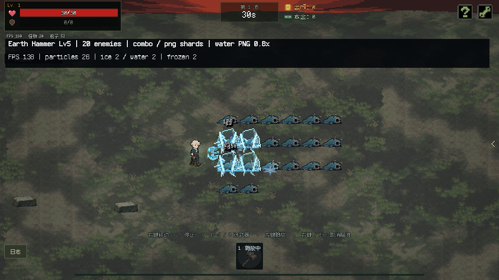

# 水波与冻结碎冰正式接入记录

2026-10-06，按用户确认替换正式资源。

- 水波：正式使用 12 张共享 PNG 图集；保留审阅版 0.8 倍视觉与碰撞半径、4 个相位、3 个细节档及 0.85 秒默认时长。范围、持续时间加成和即时附加湿润的顺序继续生效。
- 冻结／解冻碎冰：正式使用 4 张共享 PNG 图集，60fps；冻结 0.62 秒，解冻 0.72 秒。碎片数量、反馈合并、节点上限、细节档和暂停逻辑保持原样。
- 正式脚本直接预加载图集，删除旧的实时碎冰／水波栅格化代码，不依赖审阅目录、实验切换配置或性能计时脚本。16 张 PNG 与审阅素材的 SHA-256 一致。

正式素材位于 `assets/sprites/effects/water_wave` 和 `assets/sprites/effects/ice_shards`；对应脚本为 `scripts/effects/water_wave_effect.gd` 和 `scripts/effects/element_reaction_visual.gd`。

## 验证

- Godot 编辑器无界面导入与脚本编译通过。
- 图集与范围边界专项检查 41 项、单元素回归 27 项、元素反应回归 68 项，共 136 项通过。
- 使用安装后的正式源码快照，实际进入战斗，以满级裂地战锤、水流＋结霜对 20 只真实敌人施法，确认伤害、冻结反馈与解冻反馈均发生，并正常退出。无界面和 GPU 两种运行均无错误或警告。
- GPU 验证使用独立 Windows 桌面，实际引擎桌面核对一致，`foreground_samples=0`。
- 已检查 UTF-8、变更文件的 diff 格式、图集尺寸、无损导入、mipmap 和透明边缘设置。

本次是正式接入验证，未重新进行整套性能对比；此前 FPS 报告属于审阅阶段的对照环境。

单独使用 `--quit-after 120` 强制退出正在播放菜单 BGM 的主场景时，出现 4 个 OggVorbis 对象／2 个音频资源的释放提示，详细记录在 `main-verbose.log`。完整战斗流程在停止音频并清理场景后退出，无此提示；本次未修改菜单音频实现。

完整校验结果见 `verification.json`，安装素材校验值见 `promotion.json`。

接入完成后已清理临时源码快照、安装脚本和重复截图／日志，保留本记录、验证汇总、必要日志及战斗截图。
