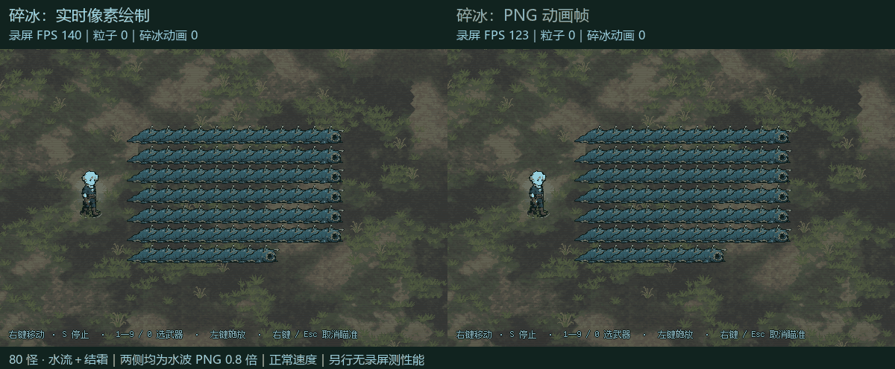
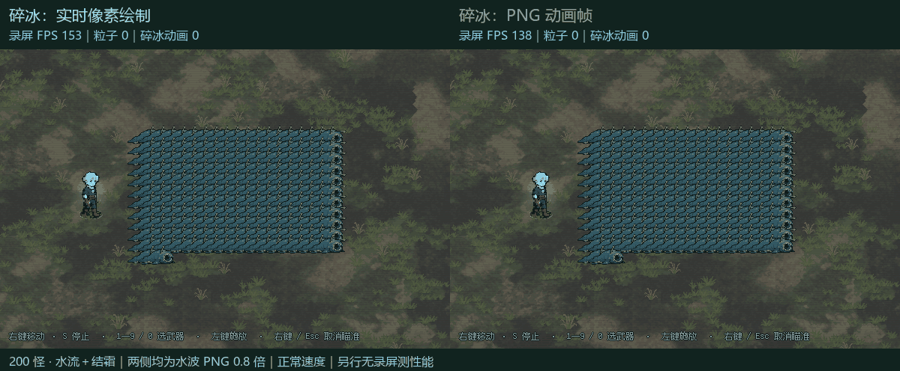
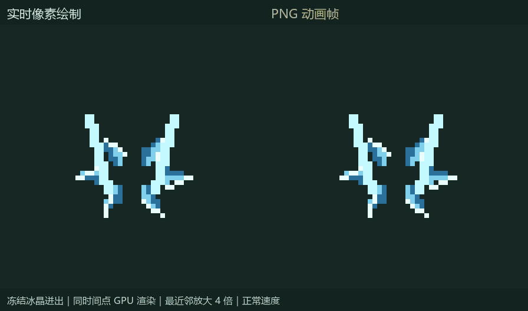

# 冻结／解冻碎冰 PNG 动画试作

安装状态：2026-10-06 已按用户确认，将本方案连同水波 PNG 0.8 倍方案接入正式项目，见 [正式接入记录](installed_20261006/installation.md)。以下保留安装前的试作与对照记录。

这次只在独立副本中替换碎冰的绘制方式，尚未替换正式资源。水波在 A/B 两侧均使用上一版 PNG 方案，视觉与碰撞半径均为正式版的 0.8 倍，因此下表衡量的是**碎冰 PNG 的额外收益**，不能直接与旧任务的 FPS 相减。

## 改了什么

- 冻结冰晶迸出：保持 0.62 秒、原有 4／6 片冰晶及侧边亮线。
- 解冻碎冰消散：保持 0.72 秒、6 片碎冰和原来的地面弧线。
- 用 Godot 将现有绘制代码离线烘焙到 PNG；60 帧／秒、最近邻采样、原尺寸与中心点。关闭会改动低透明度像素颜色的默认透明边缘修复。没有重新设计图案，也没有使用生图模型。
- 图集全局共享，在测试预热前加载；战斗中只选择图集区域，动画帧变化时才重绘。
- 保留原有同位置合并规则、96 个反馈节点上限、细节降级规则、暂停和销毁时机。怪物静态冰壳、冰场、水冰反应规则均保留。
- 4 张图集共 168 个采样帧，PNG 文件合计 45.4 KiB，RGBA8 纹理约 8.42 MiB（不含已有水波图集及驱动开销）。

## 实机对比

### 80 怪，水流＋结霜

### 200 怪，水流＋结霜

### 冻结与解冻局部放大

GIF 为正常速度。实机 GIF 的左上角 FPS 来自录屏运行，会受到读取 GPU 画面与写入视频帧的影响；性能表另用不录屏的独立运行测量。PNG／MP4 保留的颜色精度高于 GIF 的 256 色。

## 性能数据

GPU：ANGLE (Intel, Intel(R) Arc(TM) Graphics (0x00007D55) Direct3D11 vs_5_0 ps_5_0, D3D11-31.0.101.5333)；Godot 4.7.2 Compatibility，1152×648，关闭垂直同步和帧率上限。使用真实战斗场景、满级裂地战锤、水流＋结霜；真实敌人保留碰撞、受击、状态处理，只禁用追逐和接触攻击，固定密集站位与高血量，每轮预热后挥锤一次。这是用于比较渲染成本的可重复压力场景，不代表所有自然游玩场景。

20／80 怪每种实现各运行两次，第二轮反转顺序。200 怪因第二轮平均 FPS 出现较大波动，追加第三组对照，保留全部三轮。表中为各轮结果的均值；P95 为每轮第 95 百分位帧耗时的均值，越低越好。从测试开始计时，0.15 秒施法，主窗口统计 0.3～4.6 秒，包含冰场存留阶段。

| 怪物数 | 实时碎冰 FPS | PNG 碎冰 FPS | 实时 P95 | PNG P95 |
| ---: | ---: | ---: | ---: | ---: |
| 20 | 117.0 | 124.8 | 11.95ms | 10.56ms |
| 80 | 96.0 | 110.4 | 19.15ms | 14.07ms |
| 200 | 79.6 | 90.1 | 25.52ms | 17.31ms |

200 怪各轮原始结果如下。第二轮 PNG 的平均 FPS 略有回退，不能宣称所有运行都提升；P95 和方法计时应与平均 FPS 一起判断。排除了并行 Godot 引擎的采样重叠，但桌面环境的其他负载与运行间波动仍可能影响结果。

| 200 怪轮次 | 实时 FPS | PNG FPS | 实时 P95 | PNG P95 |
| ---: | ---: | ---: | ---: | ---: |
| 1 | 74.5 | 100.2 | 28.04ms | 16.22ms |
| 2 | 83.7 | 80.7 | 24.62ms | 18.61ms |
| 3 | 80.6 | 89.3 | 23.90ms | 17.10ms |

冻结集中发生的前段（0.3～1.8 秒）：

| 怪物数 | 实时碎冰 FPS | PNG 碎冰 FPS |
| ---: | ---: | ---: |
| 20 | 107.3 | 115.7 |
| 80 | 86.1 | 96.6 |
| 200 | 73.1 | 83.7 |

生成次数取第一轮，峰值取全部有效轮次中的最高值。粒子数与碎冰动画节点分开统计，GPU draw calls 是引擎合批后的调用数，并不等于代码提交的像素矩形数量。

| 怪物数 | 冻结／解冻生成次数（实时→PNG） | 粒子计数峰值（实时→PNG） | GPU draw calls 峰值（实时→PNG） |
| ---: | --- | --- | --- |
| 20 | 25/15 → 25/15 | 115 → 116 | 535 → 536 |
| 80 | 96/70 → 96/70 | 117 → 122 | 877 → 878 |
| 200 | 96/96 → 96/96 | 119 → 124 | 786 → 787 |

80 怪另行启用方法计时，统计整个 5.5 秒窗口；以下累计 CPU 不是单帧耗时，也不是 GPU 时间。两种实现帧率不同，所以调用次数也不同。

| 绘制方法 | 实时：调用次数 / 累计 CPU | PNG：调用次数 / 累计 CPU |
| --- | ---: | ---: |
| 冻结冰晶 | 2812 / 182.36ms | 3648 / 7.12ms |
| 解冻碎冰 | 3088 / 316.49ms | 3150 / 7.08ms |
| 水波（两侧均 PNG） | 432 / 2.37ms | 520 / 2.37ms |

两段碎冰绘制累计 CPU 耗时从 498.85ms 降到 14.20ms，减少 97.2%。这说明 PNG 能有效消除这部分逐帧栅格化成本，但不是整个游戏 CPU／GPU 耗时都下降同样比例。

## 正确性与限制

全部 7 组对照的总伤害、逐怪水波命中次数、冻结和解冻特效生成次数一致。

对冻结、解冻全部动画帧和三个细节档，做了 252 组同时间点 GPU 图像比较；每通道最大差值 2/255，最大全图平均绝对差值 0.019/255。多次半透明绘制烘焙为 RGBA8 图集会带来少量颜色量化差异，并非逐像素完全相等。60fps 图集还会将连续时间取样到约 16.7ms 的时间步长；暂停与生命周期检查通过。

所有 GPU 测试均在私有 Windows 桌面后台运行，验证实际引擎桌面一致且 `foreground_samples=0`。性能记录会排除采样期间其他 Godot 引擎同时运行的轮次；后续轮次明确记录采样起止时间，并留 250ms 边界余量，预热期间的重叠单独保留。原始记录见 measurements.json，逐项玩法对照见 gameplay_comparison.json。

PNG 能减少碎冰路径计算、多边形栅格化及绘制命令提交的 CPU 开销；它仍需要透明混合、动画节点更新和纹理内存。冰场的实时绘制、范围查询、状态与受击处理、场景中的怪物和草地也仍然存在，不能把 PNG 视为整场性能问题的全部解决方案。画面左上角“粒子”计数未必明显降低：原来的像素矩形属于绘制命令，并不等于粒子系统中的独立粒子。本次没有靠减少碎片数量获得收益。

正式接入后已清理临时工程、重复图集、候选运行脚本与重复日志。本目录保留审阅媒体、实测数据、原始绘制参考 `original_reaction.gd` 和安装验证记录；正式 PNG 图集位于 `assets/sprites/effects/ice_shards`，布局与来源见 [图集参数](../../../assets/sprites/effects/ice_shards/freeze_atlas.json)。
