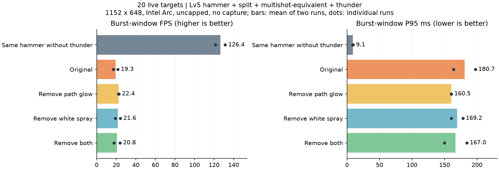
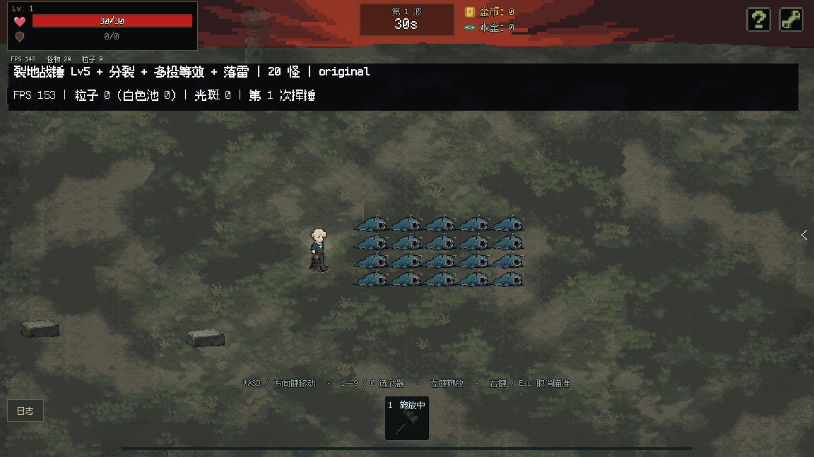
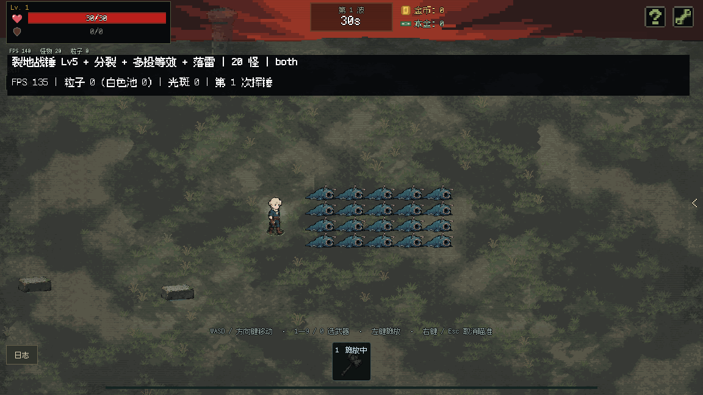

# 裂地战锤＋分裂＋多投＋落雷：20 怪实机性能分析

日期：2026-10-06。**仅分析与测试副本实验，未替换正式代码、资源或配置。**

## 结论

**性能问题已复现。** 20 只怪即可出现明显的瞬时停顿；平均帧率会被挥锤之间的冷却期拉高，因此不能只看整段平均 FPS。

保留现有 **2px 硬边、网格缓存、初始路径／独立闪回路径及 100%→60%→消失**，删除路径辉光和白色喷溅，技术上可行。测试中战斗伤害没有改变。但这两项删减**不足以解决卡顿**，剩余的黄色预警圈绘制需要优先处理。

## 测试方式与范围

- 以本次工作开始时的正式工作区建立独立副本，包含已安装的 V1–V4 优化。没有用历史旧版本代替当前基线。
- Godot 4.7.2，Compatibility / ANGLE D3D11；Intel Core Ultra 5 125H、Intel Arc 集显；窗口与世界视口均为 1152×648，关闭 VSync、不限帧。
- 启动真实 GameRoot 和战斗场景，通过 `loadout.cast_weapon()` 挥锤，使用正式的动画、地裂、分裂、落雷、范围查询、受击和伤害数字；未用直接刷落雷替代挥锤。
- 战锤 Lv5，投射物共 3 路、角度 −20°／0°／20°，每路 5 个节点，分裂为 2 条支路、夹角按配置 36°，落雷位于分裂之后；攻击范围 296，动作结束后冷却 3.6 秒。没有额外叠加历史弓箭测试中的玩家 +3 投射物。
- **附魔没有等级。** 当前武器最多两个附魔槽，因此正常装入分裂与落雷，在测试实例上补入多投唯一的 `projectile_count +1`。多投没有额外的命中派发行为，这与所述组合的运行时数值等效；它不是通过当前 UI 三槽装备流程得到的构筑。
- 主对照为 20 只高血量、固定分布的小怪，保留受击、状态和碰撞，每次挥锤前复位，防止怪死亡或走散使工作量变化。另做一次保留正常追击行为的复核。不能把本测试的 FPS 当作任意存档、任意硬件或分辨率的保证。
- 每组先预热一次挥锤，再测 16 秒，测量期间挥锤三次。正序、反序各一轮；**正式性能数据不录屏、不进行 GPU 图像回读**。
- “爆发窗口”固定为每次施法后 0.55–2.15 秒；覆盖地裂扩展、预警圈与落雷。FPS 为窗口内总帧数／总帧耗时，P95 为 95% 的帧不超过的耗时，越低越好。
- 全部 GPU 测试通过私有 Windows 桌面运行，记录验证了实际桌面一致和 `foreground_samples=0`。检测到其他测试同时使用 Godot 的旧第二轮样本已剔除；重新测量时监控其他引擎进程，接受样本无重叠。

## 无录屏对照结果

下表展示两轮各自的实测值，而非只挑最快一次。系统负载等因素造成轮间波动，小幅差异不能解释为稳定的提升比例。

| 方案 | 爆发期 FPS：第1／2轮 | P95 毫秒：第1／2轮 | 白色池峰值 | HUD 总粒子峰值 |
|---|---:|---:|---:|---:|
| 同构战锤，无落雷 | 131.4 / 121.4 | 8.6 / 9.5 | 0 | 0 |
| 正式原效果 | 21.5 / 17.1 | 164.0 / 197.5 | 900 | 1620 |
| 仅去路径辉光 | 22.7 / 22.1 | 160.5 / 160.5 | 900 | 1620 |
| 仅去白色喷溅 | 24.1 / 19.1 | 160.2 / 178.2 | 0 | 720 |
| 两项一起去掉 | 23.8 / 17.8 | 149.7 / 184.4 | 0 | 720 |

“同构战锤、无落雷”保留分裂和多投等效数值，只移除落雷，用于隔离落雷链路成本。“白色池”是共享 ParticleWorld 的存活粒子数；HUD 总粒子数还包含黄色预警圈，**不包含缓存闪电网格和光斑**。

**追击复核：** 保留 20 只小怪的正常追击行为、仍使用高血量避免清怪，8 秒内执行两次挥锤，原效果爆发期 **19.4 FPS**，P95 **174.9 毫秒**，最慢帧 **192.2 毫秒**。卡顿并非只存在于静止靶场。

## 为什么只有 20 只怪仍会卡顿

1. **特效数量由攻击几何放大，远多于怪物数量。** 每次挥锤有 3 路 × 5 节点 × 2 支路＝30 次落雷。支路端点即使没命中怪物也会建立预警并落雷。每次落雷还有初始路径和独立闪回路径。
2. **喷溅不仅在落地时发一次。** 落地发一次，每个实际受伤敌人再发一次。三次挥锤实测 90 次落雷、237 次落雷命中，总计 327 次喷溅调用。配置中的 5 个 flash 和 30 个 impact 乘 1.15 后，分别取整为 6 和 35，每次合计 41 个，三次挥锤请求 13,407 个白色粒子。这是累计申请量，并非同时存活量；900 上限会截断实际生成数量。
3. **白色喷溅已经合批。** 它仍有粒子更新、实例缓冲构建、透明叠加和关联光斑成本，但 900 个粒子并不等于 900 次独立 draw call。通常每粒子绘制本体＋辉光两份实例，池满时可见实例达到 1800。
4. **黄色预警圈尚未按这种方式合批。** 每圈 3 排 × 8 个＝24 个小粒子；每个都计算旋转／摆动，再分别画一个光斑和两层矩形，即每圈 72 次图元绘制。30 圈可以同时保留 720 个粒子，对应 2160 次图元调用量级。实测删除白色喷溅和路径辉光后，整帧 draw calls 仍在约两千的量级。

### 热点计时与定位实验

独立开启轻量方法计时、测量一次完整挥锤，原效果的脚本累计耗时如下。这里统计的是多次调用的总和，不是单帧耗时，也不包含全部渲染后端／GPU 工作；包含嵌套调用的项目不能重复相加。

| 代码阶段 | 累计脚本耗时 | 调用次数 |
|---|---:|---:|
| 黄色预警圈绘制 | 416.6 ms | 288 |
| 创建初始／闪回路径（含构建网格） | 46.0 ms | 60 |
| 落雷范围结算（含受击及命中喷溅调用） | 13.9 ms | 30 |
| 地裂节点处理 | 10.8 ms | 15 |
| 共享粒子绘制缓冲构建 | 10.7 ms | 222 |
| 共享粒子运动与生命周期 | 2.6 ms | 222 |
| 共享粒子生成 | 5.9 ms | 218 |

在“两项都删除”的副本上，额外**只跳过黄色预警圈的绘制**，继续执行其计时、落雷、伤害和命中逻辑：爆发期从 **23.8 FPS 升到 84.0 FPS**，P95 从 **166.2 ms 降到 23.7 ms**；采样到的 draw calls 峰值从 **2126 降到 765**。两者均为 30 次落雷、79 次落雷命中、伤害 2609。

这项测试用于确认热点，**不是建议删除预警，也不是已经做完合批后的性能承诺**。它仍有超过 16.7 ms 的帧，后续仍需处理剩余开销。由于仅隐藏绘制，诊断运行的原 HUD 计数器仍会报出预警粒子数量，不能把它当成实际已绘制数量。

## 两项删减的可行性与视觉变化

| 项目 | 测试副本的处理范围 | 保留内容与影响 |
|---|---|---|
| 去掉路径辉光 | 关闭白色核心周围的一圈浅蓝色像素边缘；跳过路径中点生成的环境光斑 | 仍使用 2px 核心及原来的栅格化、合并矩形、缓存 ArrayMesh；亮度过渡和路径随机规则不变。视觉更干净、外围更窄，周围地面不再被路径光斑照亮。 |
| 去掉白色矩形喷溅 | 跳过 `lightning_flash` 与 `lightning_impact` 两个命中粒子事件，同时省去这两个事件带出的光斑 | 去掉落点及敌人命中处的白色闪片和向外飞出的方块；保留黄色延迟预警、落雷本体、地面冲击环、命中时机、伤害、眩晕与元素反应。命中爆闪和冲击感会减弱。 |
| 两项同时处理 | 合并上述删减 | 白色池峰值从 900 降为 0；本构筑由这些路径及喷溅产生的光斑降为 0。仍保留 720 个黄色预警粒子，所以不能据此承诺流畅。 |

注意：删除粒子事件应该在发射入口跳过，不能仅把 `count_multiplier` 设为 0；现有发射器会将数量下限钳制为 1。两个粒子 profile 与命中函数也被链式闪电共用，实际实施时应明确作用范围，避免无意修改其他电系效果。

三次挥锤各实验组均为 **90 次落雷、237 次落雷命中、总伤害 7827**；去辉光／去喷溅没有改变伤害派发。由于极慢帧可能跨过短闪回的生命周期区间，实际创建的初始与闪回网格总数在部分运行中少于理论 180；这是当前低帧率下已有的显示跳帧，测试没有主动削减落雷次数。

## 建议的优化顺序

1. **优先合批黄色预警圈，保持视觉。** 将一个小粒子的“光斑＋两层矩形”做成可复用的组合网格，使用 MultiMesh 批量提交各个小粒子的变换与透明度。继续用原来的三排、轨道、颜色、旋转和消退曲线；预期把大量零散绘制压缩成少量批次。需要验证绘制顺序、半透明叠加和圈间遮挡，不能在未测试前承诺完全一致的画面或 FPS。
2. **按审美选择去掉白色喷溅。** 可以显著减少白色遮挡和粒子池压力，但应作为视觉清理与辅助优化，不能单独承担解决卡顿的目标。
3. **去掉路径辉光是可选的进一步简化。** 保留 2px 核心和一次构建缓存；无需重写路径成逐点粒子，也无需每帧重建网格。
4. **再复测范围查询与路径构建峰值。** 落雷仍逐次进行登记敌人筛选、形状查询、伤害处理；战锤也会反复求分裂参数及碰撞。可以在一次挥锤内复用不变参数和查询对象，但必须保持原有碰撞语义。按本次证据，优先级低于预警圈绘制；不建议先减少落雷或命中数量来“优化”。

## 实机画面与复现资料

这些 GIF 来自独立实机 GPU 录制，按实际采集时间编码。**录制包含回读和写盘，画面内的即时 FPS 不能代替上面的无录屏测量。** 后者用于查看删减的视觉范围，不是已经优化成功的版本。

原效果：

去路径辉光＋去白色喷溅的测试副本：

- 本目录：`measurements.json` 为完整两轮指标、时间采样和后台桌面验证记录；`summary.json` 为汇总。热点定位、追击复核的日志与结果另行保留。
- 独立复现工程：`D:/project/useless/review-archives/hammer-lightning-20261006/project`。本目录备份了测试入口与计数脚本；正式源码未加入测试开关。
- 主要源码位置：`scripts/weapons/earth_hammer.gd` 的 `_emit_node()`；`scripts/effects/electric_spark_effect.gd` 的 `_draw()`；`scripts/effects/lightning_particle_effect.gd` 的 `_strike_ground()`、`_damage_ground_enemies()`、`_emit_hit_burst()`；`scripts/effects/lightning_pixel_bolt.gd` 的 `build()`。

归档前校验：基线清单中的 **854 个脚本、场景、配置等文件 SHA-256 均未变化**，详见 `production-integrity.json`。正式美术素材仅供测试副本读取，没有替换操作。新增文件仅为本次审阅资料。
