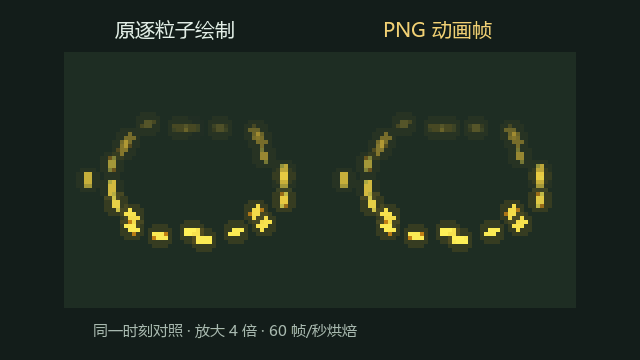
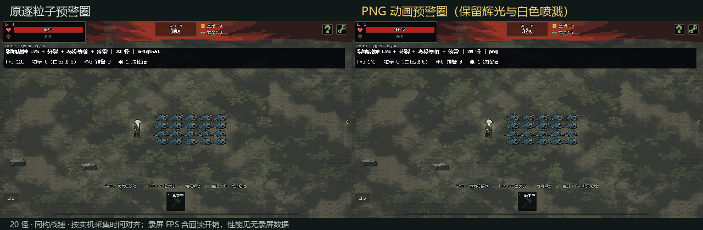
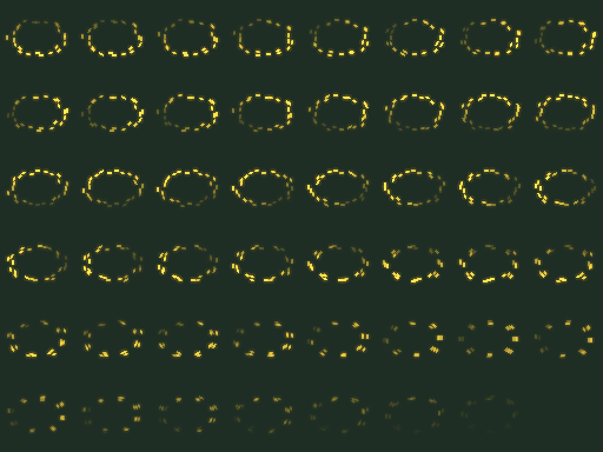

# 黄色预警圈 PNG 动画试作

2026-10-06。**试作可行，性能明显改善；尚未替换正式资源。**

## 做了什么

直接用 Godot 离线运行当前黄色预警圈的绘制代码，将旋转、亮度闪动、三排颗粒和消退过程烘焙为透明 PNG。不是模型重画，也不是运行时继续计算并绘制这 24 个粒子。

- 图集：**512×384，8列×6行，共48帧**；单帧 **64×64**，中心锚点 (32,32)，**60帧/秒**，末帧透明。
- 时间：前 0.5 秒预警，落雷后的 0.28 秒淡出。贴图只负责显示；原有 0.5 秒延迟、实际落地信号、伤害与元素反应继续由原逻辑控制。
- PNG约 **55 KB**；RGBA8 纹理约 **0.75 MiB**，无 mipmap、最近邻过滤、全部预警圈共用一张预加载图集。
- 每圈原来每次绘制 24 颗粒×3层图元＝72次图元调用，现在一次绘制一个图集区域；只有动画帧索引改变时才请求重绘。引擎还可以对使用同一图集的绘制进行合批。
- **闪电的 2px 硬边、网格缓存、路径辉光和白色喷溅均保留。** 这轮对照只改变黄色预警圈的显示方式。

## 实机结果

与上一份分析使用相同构筑：20只高血量小怪、满级裂地战锤、分裂、多投等效 +1、落雷；3路×5节点×2支路，每锤30次落雷。当前武器代码只有两个附魔槽，所以正常装入分裂、落雷，并在测试实例补入多投唯一的 +1 投射物数值。附魔不存在等级。

Intel Core Ultra 5 125H / Intel Arc，Godot 4.7.2 Compatibility / ANGLE，1152×648、不限帧、关闭 VSync。每组预热一锤，测16秒、三次挥锤，按原版→PNG→PNG→原版排列。爆发窗口仍为每次施法后0.55–2.15秒。性能测量不录屏；与其他引擎进程重叠的样本自动剔除重测。

| 方案 | 爆发期 FPS，两轮 | P95 帧耗时，两轮 | 单帧 draw calls 峰值，两轮 |
|---|---:|---:|---:|
| 原逐粒子绘制 | 18.6 / 19.0 | 175.9 ms / 184.5 ms | 2200 / 2295 |
| PNG 动画帧 | 80.2 / 81.9 | 27.6 ms / 27.9 ms | 869 / 869 |

三次挥锤，两种显示方式都为 **90次落雷、180条初始／闪回网格、237次落雷命中、伤害7827**。共享白色粒子池仍会达到 **900**，因此这次提升没有依赖关闭白色喷溅。

PNG版HUD中的“粒子”不再把黄色圈算作24个实时粒子；测试另显示 **PNG预警圈数量，峰值30**，避免将贴图误报为720个动态粒子。

正常追击复核（20怪、8秒、两次挥锤）：原绘制 **18.1 FPS / P95 178.6ms**，PNG版 **80.2 FPS / P95 28.9ms**。动态追击的接触位置受帧时序影响，命中数为175与177，不是完全相同的碰撞轨迹；伤害一致性依据上面的固定靶对照。

**仍有优化空间：** PNG版固定靶对照的P95约28ms，仍超过60FPS所需的16.7ms；个别帧约36–47ms。这表示主要卡顿已大幅缓解，不代表全程锁定60FPS。其余落雷路径构建、碰撞结算、白色粒子和冲击环仍有成本。

## 外观验证和当前边界

同一背景、同一动画时刻对照全部48帧：全帧RGB通道平均误差 **0.074/255**；仅可见区域平均误差 **0.548/255**；单通道最大误差 **5/255**。微小差异来自离屏烘焙、透明混合和8位量化。已经对GPU读回的预乘透明颜色做了还原，避免重复乘透明度造成黑边。这是固定采样时刻的像素比较，不代表任意实时帧都逐像素相同。

当前图集精确对应默认20px半径。原代码扩大圈时只扩大轨道、不扩大粒子本身；直接缩放整张PNG会让粒子变粗。因此**非默认半径仍走原绘制**，本次通过了30px半径的回退检查。正式推广到所有半径时，可再烘焙常用半径的独立图集，或保留这条回退路径。

动画按60帧/秒离散采样。若落地信号延迟，画面保持在预警段最后一帧，收到实际落地信号后才进入淡出段；不会因贴图播放结束而提前撤掉预警。正常采样时刻保持原旋转形状，异常延迟下会短暂保持姿态，这一点与原版连续计算姿态不同。已验证延迟落地的帧索引衔接。

## 实机动图与素材

左右是分别实机录制后按采集时间对齐的画面。**录屏内FPS包含GPU回读和写盘开销，性能结论以上面的无录屏数据为准。**

[MP4版本](battle_comparison.mp4) · [透明PNG图集](yellow_warning_60fps.png) · [图集参数](yellow_warning_60fps.json) · [完整测量数据](measurements.json)

候选工程位于 `D:/project/useless/review-archives/warning-png-20261006/project`。本目录备份候选代码、烘焙脚本、验证日志和指标，便于复现与审阅。

Godot headless编辑器导入和运行验证通过；GPU逐帧外观验证及实战测试均在私有Windows桌面完成，记录验证了实际桌面一致、`foreground_samples=0`。正式文件没有执行替换操作，校验结果保存在 `production-integrity.json`。
