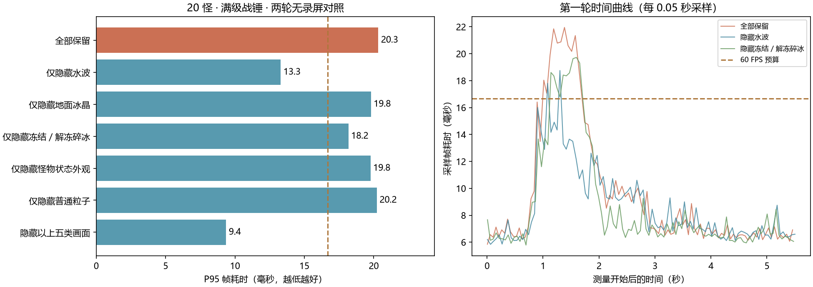
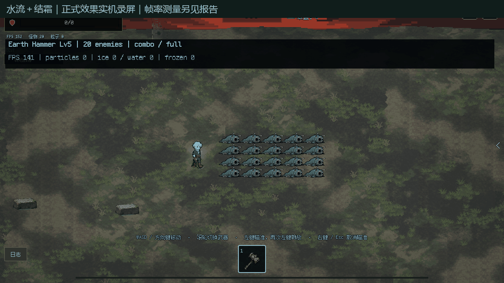
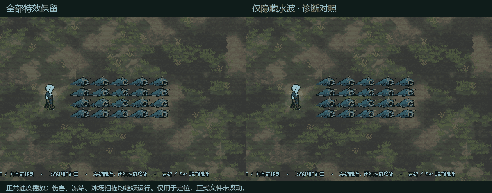

# 水流＋结霜实机性能定位

本轮依据 2026-10-06 当前正式源码建立独立诊断工程，未替换正式特效文件。

**结论：已复现短时掉帧，优先处理水波的动态像素绘制，其次处理冻结／解冻时向外飞散的碎冰。地面冰晶有持续开销，但不是本场景最突出的尖峰来源；普通粒子和怪物身上静态冰壳不是主要瓶颈。**

## 实机条件与测量边界

暂未获得此次卡顿的具体装备，因此沿用上次讨论的武器：满级裂地战锤，20 只真实敌人，安装水流、结霜两张附魔，无额外分裂或多投。满级战锤自身有 2 条攻击方向，每条 5 个节点，一次挥锤实际生成 10 个水波和 10 个冰场。附魔没有等级。

真实 GameRoot 战斗、真实武器施放和碰撞结算。固定组只禁止怪物主动追逐／接触伤害，保留受击、击退、状态、物理碰撞，并设置高血量使各组可比；另补一组恢复追逐的运行。当前结论不应外推为所有武器、附魔顺序、攻击频率下的固定排名，也不代表自然波次里怪物快速死亡时一定有相同耗时。

Godot 4.7.2，Compatibility／ANGLE，Intel Arc 集成显卡，1152×648；关闭垂直同步与帧率上限。每组预热一次挥锤，等待 6 秒，恢复靶位并清除残余湿润后测量一次挥锤。主统计窗口为测量开始后 0.3–4.6 秒，两轮反向顺序，分别统计后取平均。

性能测量不截图。录屏为另外运行，截图回读会降低帧率，动图里的 FPS 不作为下表数据。GPU 测试全部使用私有 Windows 桌面，核验 `foreground_samples=0`；并发检查未发现其他游戏测试引擎，用户已有编辑器保留。

## 无录屏实测

| 对照 | 平均 FPS | 平均帧耗时 ms | P95 ms |
| --- | ---: | ---: | ---: |
| 仅战锤 | 149.2 | 6.70 | 8.07 |
| 战锤＋水流 | 129.6 | 7.72 | 15.76 |
| 战锤＋结霜 | 128.9 | 7.76 | 10.18 |
| 全部保留 | 111.8 | 8.95 | 20.32 |
| 仅隐藏水波 | 117.3 | 8.53 | 13.29 |
| 仅隐藏地面冰晶 | 117.0 | 8.55 | 19.80 |
| 仅隐藏冻结／解冻碎冰 | 121.5 | 8.23 | 18.18 |
| 仅隐藏怪物状态外观 | 112.7 | 8.88 | 19.76 |
| 仅隐藏普通粒子 | 112.3 | 8.91 | 20.22 |
| 隐藏以上五类画面 | 142.2 | 7.03 | 9.35 |

P95 是较慢帧的指标，越低越好；60 FPS 每帧预算为 16.67 毫秒。组合在本机表现为施法期间的短时尖峰，并非持续严重低帧率。只看全段平均 FPS 会掩盖这些尖峰。

所有“仅隐藏”组只跳过指定图形绘制，保留节点、生命期、伤害、领域扫描、冻结刷新以及细节档选择；普通粒子隐藏组保留粒子生成和运动模拟。组合的各个受控组总伤害均为 3535，生成计数也一致：49 次冻结应用、39 个冻结入场提示、20 个解冻提示。冻结应用包含刷新，不等于 49 个不同敌人，也不是 49 次额外伤害。

## 哪些画面最值得处理

1. **扩散的环状水波：主要尖峰来源。** `water_wave_effect.gd` 每显示帧重建轮廓、波沿、泡沫，按细节档使用 96／48 段采样。虽然已经有线段缓存，`pixel_rect_batch.gd` 仍逐个调用 `draw_rect`，不是一次提交整片水波的网格。隐藏水波明显降低 P95；水流单独施放时粒子数为 0，仍然能产生尖峰。

2. **冻结和解冻时飞散的碎冰：组合新增的主要开销。** 这些位于 `element_reaction_visual.gd`，通过多边形像素填充和线段绘制实现，不计入普通粒子池。除了感电，当前这类提示每显示帧重画。20 只怪在这一挥锤中生成 39 个冻结提示，采样峰值也达到 39 个；随后生成 20 个解冻提示。同一敌人已冻结时再次接水会打湿，再接冰又刷新冻结并请求入场提示，而视觉只做 0.08 秒、8px 内的短时去重，所以提示数会高于敌人数。

3. **地面六角冰晶：次要但可以继续优化。** 每场最多存留 3 秒，已经按 12fps 重画，也会自动降低装饰细节。隐藏冰场改善有限，P95 仍然较高；适合后续缓存相同半径／细节／生长阶段的图形。

4. **怪物静态冰壳、普通冰粒子：当前无需优先删减。** 冰壳已按状态掩码和体型变化重画，不是每帧重建。普通 `ice_burst` 本次总共发射 130 个，完整组合采样存活峰值 116 个；仅隐藏普通粒子几乎不改善帧耗时。HUD 的粒子数覆盖不了上述水波和碎冰绘图。

## CPU 方法计时交叉验证

另一次 GPU 运行启用方法计时，保留全部特效。下面是单次挥锤 5.5 秒记录窗口内的累计方法耗时，**不是每帧耗时**；测量本身有少量开销，不与无录屏对照的整场 FPS 混用。

| CPU 方法 | 次数 | 累计 ms | 最慢单次 ms |
| --- | ---: | ---: | ---: |
| 水波绘制 | 454 | 307.18 | 1.71 |
| 冻结入场碎冰绘制 | 1227 | 86.64 | 0.21 |
| 解冻碎冰绘制 | 1440 | 155.34 | 0.25 |
| 地面冰晶绘制 | 380 | 125.53 | 1.44 |
| 怪物状态外观绘制 | 72 | 9.04 | 0.47 |
| 普通粒子绘制准备 | 665 | 17.29 | 0.26 |
| 普通粒子运动 | 660 | 5.63 | 0.06 |
| 普通粒子发射 | 10 | 0.78 | 0.10 |
| 水波范围结算（含反应） | 10 | 5.38 | 0.89 |
| 冰场扫描／结算（含反应） | 250 | 16.33 | 1.16 |
| 元素状态反应入口 | 145 | 4.64 | 0.22 |

同一次计时运行中，施法初段约 0.32–1.79 秒的窗口里，水波绘制累计约 266ms、冻结入场碎冰约 87ms、地面冰晶约 30ms，冰场扫描／结算约 9ms；解冻碎冰主要在后半段出现。水波更突出地影响前段尖峰，解冻碎冰继续增加后段负担。

这些是 CPU 方法执行与绘制提交时间，不是独立 GPU 时间。伤害扫描和反应入口包含嵌套调用，不能把它们相加推导整场帧耗时。地面扫描已经排除同一冰场命中过的敌人，单场不会每 0.12 秒重复伤害同一个敌人。

## 建议后续顺序

- 先优化水波：缓存可复用的像素轨迹／几何并批量提交，避免每帧大量脚本循环和逐矩形调用。保持透明色块叠加顺序；不能简单合并有透明叠加的方块后声称视觉不变。若采用 PNG 帧图，需保留足够动画阶段及相位变体，另做视觉审阅。
- 再优化冻结／解冻碎冰：缓存几何或预绘制动画帧，保留现有轨迹、颜色和寿命。可以另行试作“同一敌人冻结刷新只刷新状态，不重复叠入场碎冰”的去重方案；它会改变叠加外观，应先审阅。
- 冰场做有限容量的共享阶段缓存。伤害、控制时长、领域扫描、每目标首次命中规则继续保留。
- 暂不通过减少普通粒子数量或删冰壳来处理这个问题，实测收益不足以支撑它作为第一步。

## 实机画面

原效果，正常速度：

[原效果 MP4](combat.mp4)

左侧全部保留，右侧仅隐藏水波用于定位，伤害与冻结仍运行：

[诊断对照 MP4](water_diagnostic.mp4)

恢复怪物追逐的补充运行：活动窗口平均 97.2 FPS、P95 19.95ms。怪物位置和受击数量改变，因此它只用于验证正常追逐中效果能实际发生，不与固定组直接相减归因。

本报告记录正式优化前的诊断。后续水波和冻结／解冻碎冰 PNG 已接入正式项目，见 [安装记录](../freeze_png_20261006/installed_20261006/installation.md)。诊断副本和临时脚本已清理；原始数据、桌面核验与并发核验仍见 `measurements.json`，当时的源码完整性见 `source_integrity.json`。
