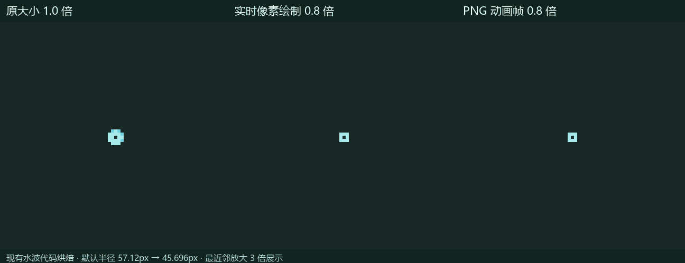
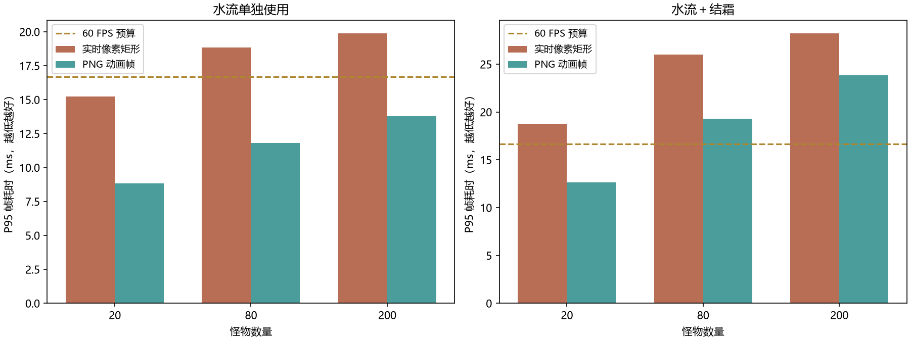
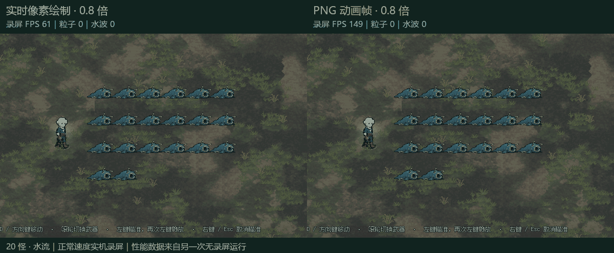
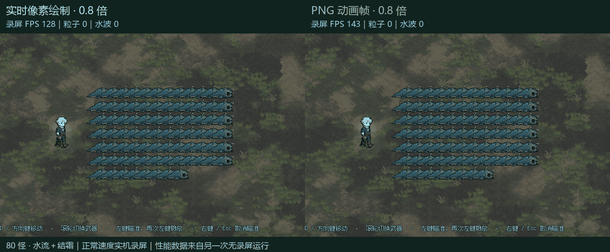
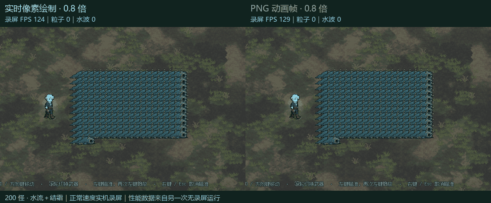

# 水波 PNG 动画帧试作与实机性能对照

2026-10-06 试作记录。后续已按用户确认，连同冻结／解冻碎冰 PNG 接入正式项目，见 [正式接入记录](../freeze_png_20261006/installed_20261006/installation.md)。以下保留试作阶段数据。

## 实现与大小

试作前的正式水波使用像素矩形绘制：每显示帧计算环状轮廓、泡沫、内侧波纹，然后经 `pixel_rect_batch.gd` 调用大量 `draw_rect`。已有线段缓存，但整个水波仍需要持续生成与提交图形。

本次把当前绘制代码直接离线烘焙成透明 PNG，保留原有配色和泡沫形状，未使用图片模型重绘。PNG 版触发后仅选择对应图集与动画帧，不再实时计算水波像素矩形。

- 两种对照实现都缩到当前大小的 **0.8 倍**。默认视觉半径／圆形伤害查询半径同步由 **57.12px → 45.696px**；圆形覆盖面积变为原来的 **64%**，水波覆盖敌人数因此可能减少。
- 原来的范围加成仍然作用于半径。伤害倍率、湿润 5 秒、减速比例及水波持续 **0.85 秒**保留。
- PNG 每个变化版本 **52 帧、60fps**，末帧透明；保留 **4 种波纹相位 × 3 档细节**，共 12 张图集、624 帧。
- 单帧 **112×112**，每图集 **896×784**，8 列 7 行。使用最近邻过滤，无 mipmap。
- 12 张 PNG 文件总计约 **707KiB**，解码后纹理数据约 **32.16MiB RGBA8**，不含引擎额外缓存。它用预先存储的纹理换取更少的运行时绘制工作。
- 测试在预热前加载图集，触发期间没有磁盘读取。正式接入时也应在进入战斗时预载，避免第一次命中才加载全部图集。

[最高细节的一张正式 PNG 图集](../../../assets/sprites/effects/water_wave/water_d2_p0.png) · [全部图集参数](../../../assets/sprites/effects/water_wave/water_atlas.json) · [动画预览](size_and_animation.gif)

## 对照条件

Godot 4.7.2、Compatibility／ANGLE、Intel Arc 集成显卡，1152×648，关闭垂直同步与帧率上限。20、80、200 只真实敌人，分别测试水流单独使用和水流＋结霜。

使用满级裂地战锤，两个攻击方向、每方向 5 个地裂节点，一次真实挥锤产生 **10 个水波**；没有额外安装分裂或多投。三档敌人数量都放在同一个区域，敌人越多密度越高。为了重复对照，禁用主动追逐和接触伤害，保留碰撞、击退、受击、状态，并设置高血量。高密度固定靶与普通波次不是完全相同的负载。

每组先预热一次挥锤，等待 6 秒，恢复靶位并清除残余湿润，再测一次挥锤。统计窗口为测量开始后的 0.3–4.6 秒，两轮反向顺序运行。表中是两轮各自统计值的均值。

两侧均使用 0.8 倍半径、同样的四种相位与原有细节档选择规则；PNG 按 60fps 取动画帧，实时版本按显示帧率连续重画。这里比较的是两种实际播放实现，不把“降低动画更新频率”与“替换绘制方式”的收益人为拆开。

性能测量不截图；后面的动图另外录制，截图回读带来的开销未混入表格。私有 Windows 桌面核验 `foreground_samples=0`。保留用户编辑器；检测到其他 Godot 引擎并发的测量均已排除并重测，原记录留在独立工程的 `excluded-runs`。

## 水流单独使用

| 怪物数 | 实时 FPS | PNG FPS | 实时 P95 | PNG P95 | P95 降幅 |
| ---: | ---: | ---: | ---: | ---: | ---: |
| 20 | 121.9 | 135.2 | 15.24ms | 8.82ms | 42.1% |
| 80 | 108.1 | 120.0 | 18.83ms | 11.81ms | 37.3% |
| 200 | 95.6 | 100.7 | 19.87ms | 13.78ms | 30.6% |

## 水流＋结霜

| 怪物数 | 实时 FPS | PNG FPS | 实时 P95 | PNG P95 | P95 降幅 |
| ---: | ---: | ---: | ---: | ---: | ---: |
| 20 | 107.7 | 113.4 | 18.75ms | 12.66ms | 32.4% |
| 80 | 90.2 | 94.6 | 26.00ms | 19.27ms | 25.9% |
| 200 | 80.8 | 83.3 | 28.20ms | 23.86ms | 15.4% |

**P95 越低越好；60fps 的每帧预算是 16.67ms。** 平均 FPS 包括水波消退后的部分时间，P95 更适合观察短时卡顿。

同一武器的水波数量固定为 10，怪物数量增加主要提高接触结算、状态与组合特效的开销。PNG 只替换水波，地面冰晶、冻结与解冻碎冰仍保留原实现；因此它不能消除水冰组合的全部性能开销。更高攻速、更多地裂或分裂带来的更多水波实例，不应直接由本表线性外推。

## 伤害与视觉验证

12 组成对测量均验证：总伤害相同、每只敌人的水波命中次数相同、每次挥锤均生成 10 个水波。

两种实现都通过独立的实际接触边界检查：距新的碰撞边界内侧 2px 的敌人被打湿，外侧 2px 的敌人不被打湿；检查包含敌人自身碰撞半径。运行记录中的水波半径均为 45.696px。

在同一深绿色背景下检查三档细节、四种相位、六个动画时间点，共 **72 组 GPU 图像对照**。同一帧轮廓对应；把多层透明矩形预先合成为 RGBA8 PNG 会产生少量颜色舍入差异。最大单通道差为 **8/255**，整张 112×112 图像的最大平均通道差约 **0.300/255**，主要出现在淡出阶段；并非逐像素完全相同。

目前验证的是默认半径。受到额外范围加成时，PNG 按实际半径以最近邻缩放，像素块宽度可能略有变化；同样保持连续比例的伤害查询半径。四种离线相位也少于原实现的连续随机相位，动画按 60fps 离散播放，这些是图集方案的视觉取舍。

## CPU 绘制计时

另一次 GPU 运行对水波绘制方法计时，20 怪、水流单独使用。下面为单次挥锤后 5.5 秒记录窗口的累计值，**不是每帧耗时**，也不是 GPU 执行时间：

- 实时矩形: 水波绘制 614 次，累计 CPU 374.69ms，最慢单次 1.406ms。
- PNG: 水波绘制 530 次，累计 CPU 2.93ms，最慢单次 0.145ms。

PNG 的 `_draw` 只提交当前帧贴图；范围查询、伤害和状态仍按原实现运行。相同图集供所有水波共享，动画帧索引跟随原效果时间，暂停时不前进，0.85 秒到期正常释放实例。

## 实机动图

左侧均为实时绘制，右侧均为 PNG 播放，**两侧都是 0.8 倍大小、正常速度**。

20 怪，水流：

[MP4](water_comparison.mp4)

80 怪，水流＋结霜：

[MP4](combo_comparison.mp4)

200 怪，水流＋结霜：

[MP4](heavy_comparison.mp4)

原始测量与桌面验证见 `measurements.json`，伤害对照见 `gameplay_comparison.json`，当时的源码完整性见 `source_integrity.json`。正式接入后已清理独立工程、重复图集与试验脚本；审阅媒体、原始绘制参考 `original_water.gd` 及这些测量记录继续保留。

本轮使用开始时的固定源码快照完成全部对照。期间主项目有其他并发修改，已记录在完整性文件中；核对确认正式水波脚本及水／冰的运行数值参数保持与快照一致。本任务仅写入独立试作工程和审阅产物。
