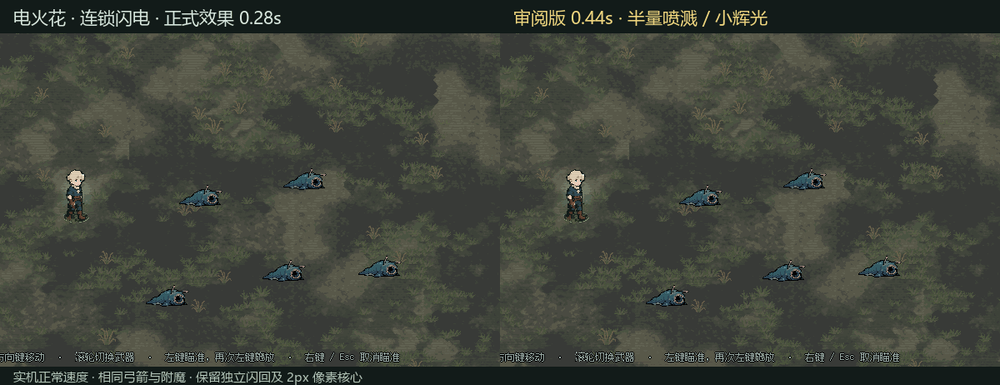
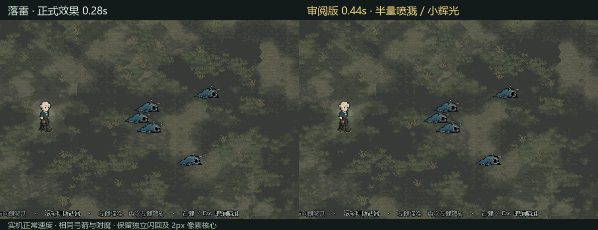

# 闪电外观调整审阅

2026-10-06。**这是视觉试作，未替换正式资源。** 本轮基于当前正式代码建立独立副本，沿用正式黄色预警圈；没有混入上一轮 PNG 预警圈试作。

## 调整内容

| 项目 | 原效果 | 审阅版 |
|---|---|---|
| 一段闪电的基础总时长 | 0.28 秒 | **0.44 秒** |
| 初始路径 | 100% 0.06s → 60% 0.06s → 消失 | **100% 0.10s → 60% 0.10s → 消失** |
| 闪回前间隔 | 0.04 秒 | 0.04 秒 |
| 独立闪回路径 | 100% 0.06s → 60% 0.06s → 消失 | **100% 0.10s → 60% 0.10s → 消失** |
| 路径辉光 | 浅蓝像素外圈＋沿路径的环境光斑 | **移除**，保留白色 2px 硬边核心 |
| 白色喷溅数量 | 原数量 | **约 50%**，整数取整 |
| 喷溅辉光范围 | 原范围 | **半径／直径乘 0.5**，不是面积乘 0.5 |

粒子数量调整同时应用于落点闪片（lightning_flash）和向外喷溅（lightning_impact）；粒子本体尺寸、颜色、速度、寿命及辉光能量没有改动。缩小的是每粒子周围的光晕和喷溅事件产生的环境光斑。

默认参数下，电火花每次命中喷溅由 6＋36＝42 个变为 3＋18＝21 个；落雷由 6＋35＝41 个变为 3＋17＝20 个。共享粒子池容量和同时发生的其他事件会影响画面中的实际存活数量，不应要求每帧 HUD 恰好减半。

电火花原本的喷溅辉光半径系数为 0.5，本次变为 0.25；落雷由 1.0 变为 0.5。仍保留落地冲击环及缩小后的命中辉光，因此落点附近依然会被照亮。2px 网格、路径随机规则、每条路径只构建一次网格、两条独立路径均保留。

## 实机对照

两组均启动真实战斗场景，用一级木质弓箭装入对应附魔，通过真实射击命中触发；各射击两次。5只高血量固定靶用于保证画面可重复查看；没有直接调用特效来代替射击。初始装备清空后重建测试弓箭，避免混入其他附魔。

动图按实际采集时间对齐、正常速度播放，裁剪战斗区域方便看清。此次不以 FPS 变化作为结论；录制也会带来图像回读开销。

### 电火花连锁

[MP4版本](lightning_comparison.mp4)

### 落雷

[MP4版本](electric_spark_comparison.mp4)

## 验证

Godot headless 编辑器检查与运行时检查通过，记录验证了两次真实射击、两条初始路径和两条独立闪回路径；候选路径均为 2px、每条仅构建一次网格、外圈像素数量为0。两次射击总伤害在前后对照中一致：电火花52、落雷66。

连锁跳跃间隔、落雷0.5秒延迟、伤害、范围和状态规则保持原样。只延长视觉路径，不额外触发命中或闪回伤害。

GPU录制通过私有Windows桌面执行，验证了实际桌面匹配及 foreground_samples=0。当前正式闪电、预警圈、粒子池脚本校验未变。独立候选工程：`D:/project/useless/review-archives/lightning-look-20261006/project`。本目录保存动图、MP4、运行记录及可审阅代码差异 `candidate.diff`。
