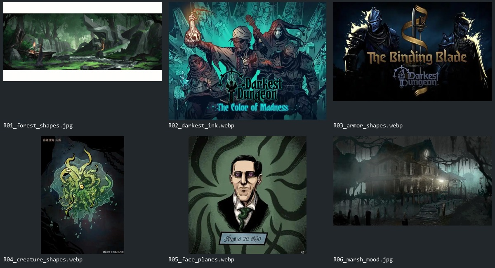

# 参考图与统一规范

以下参考均来自项目 `artifacts/reference/`，本包提供原字节副本和 SHA-256 来源表，没有从网络拼入新的画风。参考图的文字、商标和人物身份不属于生成内容。

| 编号 | 上传文件 | 指定用途 |
|---|---|---|
| R01 | [森林块面](references/R01_forest_shapes.jpg) | 场景的大块面、岩石切面、前中远层次；不是要求把湿地变成森林 |
| R02 | [暗黑地牢线面](references/R02_darkest_ink.webp) | 所有类别的共同轮廓/阴影语言；减少密集排线，降低大面积高饱和青色 |
| R03 | [盔甲块面](references/R03_armor_shapes.webp) | 骑士、铁器、金属边框的概括形状；不复制徽记、文字与原武器 |
| R04 | [生物剪影](references/R04_creature_shapes.webp) | 普通怪的触手、有机轮廓与不对称；不要照搬亮绿色黏液表现 |
| R05 | [人脸明暗](references/R05_face_planes.webp) | 哥布林与人物面部的块面概括；不复制肖像身份 |
| R06 | [湿地气氛](references/R06_marsh_mood.jpg) | 湿地、旧建筑、薄雾层次；不借用写实纹理 |

允许自由设计新造型的批次使用**一张主画风参考＋文字设计要求，按需加一张用途明确的辅助参考**。按类别与材质变化选图，保持深轮廓、硬阴影、大块面和低噪点的共同画法；不再固定同一张图。此类批次不上传旧图标、旧图集或上一轮道具母稿，以免影响新造型。遗物单参考示例见[第二批从零设计配方](batches/relics_sheet_02/from_scratch_r02/README.md)。需要保留物件设计、角色身份、动画连贯性或既定UI结构时，按已确认的要求加入主体参考；当前武器批次采用下述规则。

## 统一设计方向

武器当前采用[要素重设计r03](batches/weapons_sheet_01/elements_r03/README.md)：从原图提取少数识别特征写入文字，只上传单张画法参考，让外轮廓、比例、组合和视角自由变化。r02的原图造型表及结构锁定提示已停用，用户反馈它使模型仅将原造型高清化。保留物件身份不等于锁定整个设计；只有任务明确要求复刻造型时，才使用相应的形状约束。

UI保留不同用途的结构层级：属性栏为金属包边＋少量皮带的大底图；日志、顶部guide_bar、底部按钮等保持原样。统一配色与绘制语言不代表统一边框，最新范围与属性栏参考见 [09](09_ui_scope_and_stats_redraw.md)。

- 轮廓：完整、深色、力度稳定；最终1px/2px线宽取决于用途，不机械要求所有尺寸都同粗。
- 明暗：以大块面和硬边阴影为主；每种主要材质约3档，避免密集排线、写实毛孔和颗粒质感。
- 色彩：青灰石材、暗棕木/皮革、旧金、骨白；红、蓝、紫等承担功能识别。暗黑不等于把全部颜色压成近黑。
- 光源：单件角色/道具以左上主光为候选共同规范；场景可有局部火光，但保持主体可读。
- 角色比例：先用统一的概括比例做小样，建议约4～5头身作为候选；高清审阅后锁定，后续不随模型改变。
- 克苏鲁元素：用于关键局部和生物结构；不在所有按钮、金币、药瓶上重复加眼睛和触手。
- 高清稿：清晰概括插画，不生成假像素、网格、马赛克；素材身份、视角与大结构先正确。

上述比例和组件尺寸是本方案建议，尚不是用户已批准的像素成品。首批审阅后将确认值写回任务清单。

## 输入与输出

| 类别 | 豆包高清输入建议 | 后处理与显示规划 |
|---|---|---|
| 图标 | 单件建议1024×1024；批量按各包布局与最高可用分辨率，保留完整轮廓 | 遗物已统一64×64；本批武器候选64×64，审阅后对齐显示；附魔尺寸待该批核定 |
| 角色/怪物 | 1024×1024或1024×1536单帧，保持全身和持物 | 推荐玩家/普通怪64、骑士128，先完成新美术，再按07对齐工程，不提前迁移旧帧 |
| 哥布林表情 | 1024×1024，头部、上身、双手完整 | 每帧128×128，统一头部大小、双手接触线与色板 |
| 属性栏专用大底图 | 建议1024×1792竖向，原金属包边＋少量皮带 | 审阅后保比例进行矩形像素导出，再依据新图决定拆分与显示尺寸；不压成128方图 |
| 导航条与按钮 | 保留现有资源 | 本批不重绘、不换框、不派生统一主题 |
| 湿地场景件 | 1024×1024，单件，指定地表/立体视角 | 保留128×128工程画布；新内容范围与物理大小分开记录 |
| 全屏背景 | 2048×1152，16:9，无文字无按钮 | 候选逻辑设计尺寸1152×648，与当前基准匹配；矩形/分层导出，不能压成128方图 |

真实透明优先。若豆包不能给出可靠 alpha，使用统一纯色底，Codex观察后抠图。白色物体需要保留清晰深轮廓，不能凭“白色就是背景”全图删色；技术底色需先确认不属于主体。不要使用画出来的棋盘格。

单个Picxel资产最多16色、硬透明、无抖色；同一角色各帧和同一套UI固定数值色板。场景不同材质可使用协调的不同16色色板；组合场景不要求整个屏幕只剩16种颜色。

当前1920×1080采样存在从1152×648整体放大的情况。P0须在实际窗口中记录这条缩放链，优先选择原生像素适配或整数像素缩放的实现；不能用高分辨率截图证明纹理原生清晰。该工程决策在正式替换前完成，用户的游玩视野和碰撞行为一并复核。
