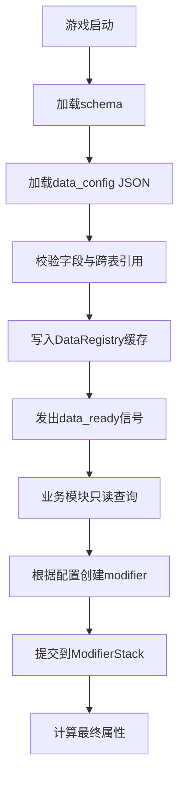

# 基础数值与数据配置模块详细设计方案

本文档是 `overview_division.md` 中“基础数值与数据配置”模块的详细设计。目标是为所有后续模块提供统一、可扩展、可校验、可调试的数据底座，避免武器、遗物、羁绊、角色、敌人、营地成长等系统各自维护独立数值逻辑。

## 1. 模块定位

### 1.1 核心目标

1. 建立统一的数据加载入口 `DataRegistry`，集中读取、校验、缓存 `data_config/*.json`。
2. 建立统一的属性计算入口 `ModifierStack`，所有数值增减都通过 modifier 叠加完成。
3. 建立稳定的配置 schema，保证 AI协作、手工填表、后续扩展时字段不混乱。
4. 支持局内与局外系统共享数据：武器、遗物、羁绊、角色、敌人、营地建筑、波次、掉落等。
5. 支持调试与平衡：能追踪某个最终属性来自哪些来源、以什么顺序叠加。

### 1.2 不负责的内容

本模块只负责“数据定义、加载、校验、查询、属性计算”，不直接负责以下内容：

1. 不负责武器攻击逻辑。
2. 不负责敌人AI与刷怪。
3. 不负责UI绘制。
4. 不负责存档文件的完整读写流程。
5. 不负责营地建筑界面交互。
6. 不负责音频、粒子和视觉表现。

这些模块可以读取本模块提供的数据，也可以提交 modifier，但不能绕过本模块直接改最终属性。

## 2. 设计原则

1. **配置驱动**：新增武器、遗物、敌人、营地建筑升级项时，优先通过 JSON 配置完成。
2. **强ID引用**：所有跨表引用使用稳定字符串ID，例如 `weapon_void_blade`、`bond_void_mutation`。
3. **启动校验**：游戏启动时一次性加载并校验配置，运行中禁止反复读磁盘。
4. **业务只读**：业务模块只读取 `DataRegistry` 返回的数据副本或只读字典，不直接修改原始配置缓存。
5. **属性统一计算**：最终属性只由基础属性 + `ModifierStack` 计算得出。
6. **来源可追踪**：每个 modifier 必须记录来源模块、来源ID、目标属性和叠加规则。
7. **MVP可用，后续可扩展**：首版 schema 保持简洁，但预留 `tags`、`effects`、`unlock_conditions` 等扩展字段。

## 3. Godot工程落点

### 3.1 推荐目录

```text
res://
├─ autoloads/
│ └─ data_registry.gd
├─ scripts/
│ ├─ data/
│ │ ├─ data_schema.gd
│ │ ├─ data_validator.gd
│ │ ├─ data_query.gd
│ │ ├─ stat_definitions.gd
│ │ └─ config_ids.gd
│ └─ modifiers/
│   ├─ modifier.gd
│   ├─ modifier_stack.gd
│   ├─ modifier_calculator.gd
│   └─ modifier_source.gd
└─ data_config/
  ├─ schemas/
  │ ├─ weapon_schema.json
  │ ├─ relic_schema.json
  │ ├─ bond_schema.json
  │ ├─ character_schema.json
  │ ├─ enemy_schema.json
  │ ├─ camp_building_schema.json
  │ ├─ wave_schema.json
  │ └─ drop_table_schema.json
  ├─ weapons.json
  ├─ relics.json
  ├─ bonds.json
  ├─ characters.json
  ├─ enemies.json
  ├─ camp_buildings.json
  ├─ waves.json
  └─ drop_tables.json
```

### 3.2 Autoload建议

| Autoload | 职责 | 是否MVP必需 |
| ---- | ---- | ---- |
| `DataRegistry` | 配置加载、校验、查询、缓存 | 是 |
| `GameGlobal` | 全局运行状态、模式状态 | 是 |
| `SaveSystem` | 存档读写、进度保存 | 局外阶段必需 |
| `AudioMixer` | 音频播放与音量管理 | 可后置 |

`DataRegistry` 应该尽早作为 Autoload 接入，因为其他模块都依赖配置查询。

## 4. 数据生命周期



### 4.1 启动阶段

1. `DataRegistry._ready()` 执行加载。
2. 读取 `data_config/schemas/*.json`。
3. 读取所有业务配置 JSON。
4. 逐表校验必填字段、字段类型、默认值。
5. 校验跨表ID引用，例如遗物引用的羁绊ID必须存在。
6. 缓存为只读数据。
7. 发出 `data_ready` 信号。

### 4.2 运行阶段

1. 业务模块通过 `DataRegistry.get_weapon(id)` 等接口查询。
2. 查询返回数据副本或只读结构，业务模块不能直接写入缓存。
3. 业务模块根据配置中的 `effects` 创建 modifier。
4. modifier 提交给角色、武器、召唤物或全局战斗上下文的 `ModifierStack`。
5. 需要最终属性时，通过 `ModifierStack.get_stat(stat_id)` 查询。

### 4.3 调试阶段

1. 提供 `DataRegistry.validate_all()` 手动重新校验。
2. 提供 `ModifierStack.debug_stat(stat_id)` 查看属性来源。
3. 提供 `DataRegistry.find_refs(id)` 查找某个ID被哪些配置引用。
4. 后续可扩展热重载，但正式运行默认不开启。

## 5. 统一ID规范

### 5.1 ID命名格式

| 类型 | 格式 | 示例 |
| ---- | ---- | ---- |
| 武器 | `weapon_*` | `weapon_void_blade` |
| 遗物 | `relic_*` | `relic_deep_eye` |
| 羁绊 | `bond_*` | `bond_void_mutation` |
| 角色 | `character_*` | `character_void_hunter` |
| 敌人 | `enemy_*` | `enemy_mutated_grub` |
| Boss | `boss_*` | `boss_many_eyed_watcher` |
| 营地建筑 | `camp_*` | `camp_memory_obelisk` |
| 波次 | `wave_*` | `wave_stage_01` |
| 掉落表 | `drop_*` | `drop_basic_enemy` |
| 效果 | `effect_*` | `effect_bonus_damage_small` |
| modifier | `mod_*` | `mod_weapon_damage_percent` |

### 5.2 ID规则

1. 全部小写 snake_case。
2. ID 一旦发布到存档或配置引用中，不允许随意改名。
3. 删除配置项时，需要保留迁移说明或兼容映射。
4. UI显示文本不要直接使用ID，必须通过 `display_name` 或本地化字段读取。

## 6. 通用属性定义

### 6.1 属性分类

| 分类 | 属性ID | 含义 | 适用对象 |
| ---- | ---- | ---- | ---- |
| 生存 | `max_hp` | 最大生命 | 玩家/敌人/召唤物 |
| 生存 | `hp_regen` | 每秒回血 | 玩家/敌人/召唤物 |
| 生存 | `shield` | 护盾值 | 玩家 |
| 生存 | `armor` | 护甲值，用于通过曲线函数计算受到伤害百分比 | 玩家/敌人/召唤物 |
| 生存 | `damage_taken_percent` | 受到伤害百分比，由护甲与其他减伤modifier共同影响 | 玩家/敌人/召唤物 |
| 移动 | `move_speed` | 移动速度 | 玩家/敌人/召唤物 |
| 攻击 | `melee_damage` | 近战伤害，固定数值加成 | 近战武器/近战效果 |
| 攻击 | `ranged_damage` | 远程伤害，固定数值加成 | 远程武器/投射物效果 |
| 攻击 | `summon_damage` | 眷族伤害，固定数值加成 | 召唤物/眷族实体 |
| 攻击 | `damage_percent` | 通用伤害百分比加成，影响近战、远程、眷族等伤害 | 通用 |
| 攻击 | `attack_speed` | 攻击速度；实际攻击间隔 = 武器固定速率 / (1 + attack_speed / 100)，例如 attack_speed=100 表示加速一倍 | 武器 |
| 攻击 | `cooldown_reduction` | 冷却缩减 | 武器/技能 |
| 暴击 | `crit_chance` | 暴击率 | 武器/玩家 |
| 暴击 | `crit_damage` | 暴击伤害百分比 | 武器/玩家 |
| 投射物 | `projectile_count` | 投射物数量 | 武器 |
| 投射物 | `pierce_count` | 穿透次数 | 武器 |
| 范围与控制 | `area_size` | 攻击范围加成；统一加成近战、远程、范围武器的命中/影响半径 | 武器/领域 |
| 范围与控制 | `duration_percent` | 持续时间加成 | 领域/状态效果 |
| 范围与控制 | `slow_percent` | 减速效果 | 状态效果 |
| 范围与控制 | `control_power` | 控制强度，影响减速、定身等控制效果强度 | 武器/遗物/羁绊 |
| 掉落与成长 | `pickup_radius` | 拾取范围 | 玩家 |
| 掉落与成长 | `exp_gain_percent` | 经验获取加成 | 玩家/全局 |
| 掉落与成长 | `drop_rate_percent` | 掉落率加成 | 全局 |
| 掉落与成长 | `luck` | 幸运，影响稀有遗物、稀有升级选项、额外掉落等概率 | 玩家/全局 |
| 掉落与成长 | `currency_gain_percent` | 局内/结算货币获取加成 | 玩家/全局 |
| 掉落与成长 | `finance` | 理财本金；每波开始前可存入或取出的局内金币本金 | 玩家/全局 |
| 掉落与成长 | `interest_rate` | 利率；默认 5，波次结束按理财本金结算利息并加入本金 | 玩家/全局 |
| 构筑 | `load_capacity` | 玩家负载上限；武器自身负载消耗归属武器模块配置 | 玩家/全局 |
| 召唤 | `summon_count` | 召唤数量 | 召唤物系统 |
| 精神/外神 | `humanity` | 理智值/人性，初始满值；值越低，侵蚀度积蓄越快，越过阈值后状态命名更新为“人性”相关阶段 | 玩家/全局 |
| 精神/外神 | `divinity` | 侵蚀度/神性，初始0；表示与克苏鲁外神的靠近程度，越过阈值后状态命名更新为“神性”相关阶段 | 玩家/全局 |

### 6.2 属性设计规则

1. 使用 `*_percent` 表示百分比加成，避免和基础值混用。
2. 最终属性必须设置合理上下限，例如移速、暴击率、冷却缩减。
3. 负面效果也使用同一属性系统，例如降低拾取范围就是 `pickup_radius` 的乘法 modifier。
4. 临时状态不新增独立字段，优先使用 modifier 的 `duration` 和 `source` 表达。
5. `armor` 不直接等于减伤比例，需要通过曲线换算为 `damage_taken_percent`，避免高护甲达到100%减伤。
6. 武器自身负载消耗不进入通用属性表，放在局内武器模块的 `load_cost` 配置与负载计算中处理。


### 6.2.1 整数数值约定

1. 配置表、设计文档、存档中的常规数值统一使用整数；仅 `runtime_effects` 中明确需要细粒度比例的字段允许小数，例如 `0.1`、`0.2`、`0.3`。
2. 百分比字段直接写百分数整数：`damage_percent = 10` 表示伤害 +10%；`area_size = 40` 表示攻击范围 +40%。
3. 承伤字段使用“最终承受百分比”：`damage_taken_percent = 89` 表示承受 89% 伤害，即等效 11% 减伤。
4. 攻速字段使用加速百分比：`attack_speed = 100` 时，实际攻击间隔 = 武器固定速率 / (1 + 100 / 100)。
5. 冷却缩减字段使用缩短百分比：`cooldown_reduction = 40` 时，原始 10 秒冷却变为 6 秒。
6. 时间类配置优先使用毫秒整数，例如 `cooldown_ms = 600`、`spawn_interval_ms = 1200`。

### 6.2.2 攻击范围口径

1. `area_size` 是唯一的攻击范围加成属性。
2. 所有近战、远程、范围武器的最终攻击范围都使用：`最终攻击范围 = 武器基础半径 * (1 + area_size / 100)`。
3. 武器配置中的 `hit_radius` 只表示武器自身的基础命中/影响半径，不是可成长属性。
4. `pickup_radius` 只控制经验球和掉落物吸附范围，不参与任何武器攻击范围计算。
5. `duration_percent` 只控制持续效果时间，不参与攻击范围计算。

### 6.2.3 理财与利率

1. 每波开始前，玩家可以打开理财页，选择存入、取出或跳过。
2. 存入会扣除当前局内金币并增加本金；取出会减少本金并返还局内金币。
3. 本波攻击结束后，只结算利息收益，不自动返还本金；收益按 `ceil(finance * interest_rate / 100)` 计算并加入本金。
4. `interest_rate` 默认值为 `5`，表示默认利率 5%；该属性允许小数成长以支持复利类遗物。
5. 理财本金和收益不吃 `currency_gain_percent`，避免金币增益与本金复利形成重复放大。

### 6.3 护甲减伤曲线

护甲用于计算受到伤害百分比，推荐公式：

```text
damage_taken_from_armor = 100 * ARMOR_K / (ARMOR_K + max(armor, 0))
final_damage = incoming_damage * damage_taken_from_armor / 100 * other_damage_taken_percent / 100
```

建议初始常量：

| 常量 | 建议值 | 说明 |
| ---- | ---- | ---- |
| `ARMOR_K` | `100` | 曲线缓冲常量，数值越大，护甲收益衰减越慢 |
| `MIN_DAMAGE_TAKEN_PERCENT` | `5` | 最低受到伤害百分比，防止100%减伤 |

示例：

| 护甲 | 护甲带来的受到伤害百分比 | 等效减伤 |
| ---- | ---- | ---- |
| 0 | 100 | 0% |
| 50 | 67 | 33% |
| 100 | 50 | 50% |
| 200 | 33 | 67% |
| 400 | 20 | 80% |

最终结果仍需经过 `MIN_DAMAGE_TAKEN_PERCENT` clamp，确保受到伤害百分比不会降到0。

### 6.4 人性与神性规则

1. `humanity` 初始为满值，代表玩家作为“人”的稳定程度；越低，`divinity` 积蓄速度越快。
2. `divinity` 初始为0，代表克苏鲁外神侵蚀或靠近程度；越高，越容易触发强力但危险的外神化效果。
3. 当 `humanity` 或 `divinity` 越过关键阈值时，只更新状态阶段、UI称谓和可触发效果，不应临时新增一套独立属性系统。
4. 阈值、阶段名、侵蚀速度公式后续在遗物/羁绊或克苏鲁氛围模块中详细设计；基础数值模块只保留字段与计算入口。

## 7. ModifierStack设计

### 7.1 modifier基础字段

```json
{
  "id": "mod_void_blade_damage_1",
  "source_type": "weapon",
  "source_id": "weapon_void_blade",
  "target_scope": "player",
  "stat": "damage_percent",
  "operation": "add_percent",
  "value": 15,
  "duration": -1,
  "stack_rule": "replace_same_source",
  "priority": 500,
  "tags": ["weapon", "damage"]
}
```

### 7.2 字段说明

| 字段 | 类型 | 必填 | 说明 |
| ---- | ---- | ---- | ---- |
| `id` | string | 是 | modifier唯一ID |
| `source_type` | string | 是 | 来源类型：weapon/relic/bond/camp/debuff等 |
| `source_id` | string | 是 | 来源配置ID |
| `target_scope` | string | 是 | 作用范围：player/weapon/global/enemy/summon等 |
| `stat` | string | 是 | 影响的属性ID |
| `operation` | string | 是 | 叠加方式 |
| `value` | number | 是 | 数值 |
| `duration` | number | 是 | 持续时间，`-1`代表永久直到移除 |
| `stack_rule` | string | 是 | 堆叠规则 |
| `priority` | int | 否 | 计算优先级 |
| `tags` | array | 否 | 查询和调试用标签 |

### 7.3 operation类型

| operation | 说明 | 示例 |
| ---- | ---- | ---- |
| `add_flat` | 最终值增加固定值 | 最大生命 +20 |
| `add_percent` | 增加百分比加成，通常汇总后乘算 | 伤害 +15% |
| `multiply` | 独立乘区 | 最终伤害 x1.2 |
| `override` | 覆盖值 | 暴击率固定为100% |
| `min_cap` | 设置最小值 | 移速最低不低于80 |
| `max_cap` | 设置最大值 | 暴击率最高100% |

### 7.4 stack_rule类型

| stack_rule | 说明 | 用途 |
| ---- | ---- | ---- |
| `unique` | 同ID只存在一个 | 唯一被动 |
| `replace_same_source` | 相同来源替换旧值 | 武器升级、建筑升级 |
| `stack_add` | 可叠加，多份累加 | 击杀叠层、临时增益 |
| `stack_with_limit` | 可叠加但有上限 | 棱彩羁绊伤害叠层 |
| `refresh_duration` | 重复获得时刷新持续时间 | debuff/短时buff |
| `exclusive_group` | 同组互斥，只保留一个 | 后续特殊机制预留 |

### 7.5 计算顺序

建议优先级：

1. `base`：基础属性。
2. `character`：角色基础与被动。
4. `camp`：营地建筑。
5. `weapon`：武器自身与武器升级。
6. `relic`：遗物效果。
7. `bond`：羁绊效果。
8. `temporary_buff`：局内临时正面效果。
9. `temporary_debuff`：局内临时负面效果。
10. `cap`：最终上下限修正。

### 7.6 推荐接口

```gdscript
class_name ModifierStack

func add_modifier(modifier: Modifier) -> void
func remove_modifier(modifier_id: String) -> void
func remove_by_source(source_type: String, source_id: String) -> void
func has_modifier(modifier_id: String) -> bool
func get_stat(stat_id: String, base_value: float = 0.0) -> float
func get_all_modifiers(stat_id: String = "") -> Array[Modifier]
func tick(delta: float) -> void
func debug_stat(stat_id: String) -> Dictionary
```

### 7.7 额外效果兼容逻辑

不是所有效果都适合放入通用属性表。例如“所有神秘伤害+10%”只对带有特定标签的伤害生效，它不是玩家常驻面板属性，也不应新增为 `mystic_damage_percent` 这类硬编码基础属性。

为兼容这类效果，配置表允许在羁绊阈值中同时写入两类内容：

1. `modifiers`：标准属性修改，进入 `ModifierStack`，例如 `melee_damage + 2`、`divinity + 10`。
2. `extra_effects`：标签、触发、条件、特殊逻辑类效果，由后续对应业务模块解释执行。

推荐 `extra_effects` 最小结构：

```json
{
  "effect": "tagged_damage_percent",
  "target_tags": ["mystic"],
  "value": 10
}
```

`tagged_damage_percent` 的执行逻辑：

1. 后续战斗/伤害模块生成伤害包 `DamagePacket`，伤害包携带 `damage_kind` 与 `damage_tags`。
2. 克苏鲁相关武器、营地建筑升级效果或其他效果在配置中标记 `damage_tags: ["mystic"]`。
3. 伤害结算时，额外效果管理器查找所有 `effect_type = "tagged_damage_percent"` 的激活效果。
4. 如果伤害包的 `damage_tags` 命中 `target_tags`，则按 `value` 增加该伤害。
5. 该效果不进入 `StatDefinitions`，也不由 `ModifierStack.get_stat()` 直接计算，避免基础属性表膨胀。

推荐后续新增轻量运行容器：`ExtraEffectRegistry` 或 `EffectContext`。

职责：

1. 接收羁绊、遗物、营地建筑升级提交的 `extra_effects`。
2. 按 `source_type/source_id/stack_rule` 管理替换、互斥与移除。
3. 提供查询接口，例如 `get_tagged_damage_percent(damage_tags: Array[String])`。
4. 不直接修改基础属性，只在对应业务结算点提供额外百分比或触发动作。

这样可以兼容：

1. 神秘伤害加成：`tagged_damage_percent` + `target_tags: ["mystic"]`。
2. 对Boss伤害加成：`tagged_damage_percent` + `target_tags: ["boss"]`。
3. 命中触发流血：后续可扩展 `effect_type: "on_hit_apply_status"`。
4. 击杀回复生命：后续可扩展 `effect_type: "on_kill_heal"`。

原则：只有“稳定、通用、常驻、可展示”的数值进入 `StatDefinitions`；条件型、标签型、触发型效果进入 `extra_effects`。
## 8. DataRegistry设计

### 8.1 职责

1. 管理所有配置文件路径。
2. 加载 JSON 并转换为 Godot Dictionary/Array。
3. 校验 schema 与跨表引用。
4. 提供按ID查询、按标签查询、按条件查询。
5. 提供调试接口和错误报告。
6. 为其他模块提供稳定的数据访问层。

### 8.2 推荐接口

```gdscript
class_name DataRegistry
extends Node

signal data_ready
signal data_load_failed(errors: Array)

func is_ready() -> bool
func reload_all() -> bool
func validate_all() -> Array[String]

func get_weapon(id: String) -> Dictionary
func get_relic(id: String) -> Dictionary
func get_bond(id: String) -> Dictionary
func get_character(id: String) -> Dictionary
func get_enemy(id: String) -> Dictionary
func get_camp_building(id: String) -> Dictionary
func get_wave(id: String) -> Dictionary
func get_drop_table(id: String) -> Dictionary

func get_all_weapons() -> Array[Dictionary]
func find_by_tag(table_name: String, tag: String) -> Array[Dictionary]
func find_refs(config_id: String) -> Array[Dictionary]
```

### 8.3 查询规则

1. 单项查询找不到ID时，返回空字典并打印明确错误。
2. 批量查询返回副本，避免业务层误改缓存。
3. 按标签查询应支持多个标签 AND 过滤。
4. `DataRegistry` 只处理静态配置，不保存玩家运行时状态。

## 9. 配置表分层

### 9.1 基础实体层

负责定义游戏对象的静态属性。

包含：
1. `weapons.json`
2. `relics.json`
3. `characters.json`
4. `enemies.json`

特点：
1. 武器记录只保留 `id/display_name/icon/rarity/tags/weapon_type/load_cost/max_level/attack_interval_ms/base_stats/level_upgrades` 等运行必要字段；其他实体可按模块保留展示字段。
2. 不存储玩家个人开放列表；开放状态由营地建筑等级和升级项等级派生。
3. 可以引用效果定义层中的 modifier 或内联轻量效果。

### 9.2 效果定义层

负责定义可复用效果。

包含：
1. `bonds.json`
2. 后续可扩展 `effects.json`、`debuffs.json`、`status_effects.json`

特点：
1. 所有效果最终都转化为 modifier 或可执行 action。
2. 复杂效果拆成 `trigger + condition + modifiers/actions`。
3. 不直接写死到脚本中。

### 9.3 成长解锁层

负责定义局外成长。

包含：
2. `camp_buildings.json`
3. 后续可扩展 `unlock_rules.json`

特点：
1. 只定义解锁条件和成长效果。
2. 玩家实际开放状态由存档中的建筑等级和升级项等级派生，不单独保存解锁列表。
3. 效果同样通过 modifier 进入属性系统。

### 9.4 运行曲线层

负责定义单局流程与奖励。

包含：
1. `waves.json`
2. `drop_tables.json`
3. 后续可扩展 `difficulty_curves.json`、`rift_events.json`

特点：
1. 决定什么时候刷什么怪、掉什么奖励。
2. 不直接保存运行时进度。
3. 可根据模式读取不同曲线。

## 10. 最小schema草案

### 10.1 通用记录字段

所有配置记录建议包含：

```json
{
  "id": "unique_id",
  "display_name": "显示名称",

  "tags": [],
  "enabled": true
}
```

### 10.2 weapons.json

```json
{
  "id": "weapon_void_blade",
  "display_name": "小飞刃",
  "icon": "res://assets/ui/icons/weapons/weapon_void_blade.png",
  "rarity": "common",
  "tags": ["weapon", "ranged", "void", "starter"],
  "weapon_type": "light",
  "load_cost": 12,
  "max_level": 5,
  "attack_interval_ms": 700,
  "base_stats": {
    "ranged_damage": 8,
    "attack_speed": 0,
    "crit_chance": 5,
    "crit_damage": 150,
    "projectile_count": 1,
    "pierce_count": 0
  },
  "level_upgrades": {
    "2": [
      { "stat": "ranged_damage", "value": 2 },
      { "field": "attack_interval_ms", "value": -50 }
    ],
    "5": [
      { "stat": "ranged_damage", "value": 2 },
      { "field": "attack_interval_ms", "value": -50 },
      { "stat": "projectile_count", "value": 1 }
    ]
  }
}
```

武器配置规则：

1. `weapons.json` 只保留运行和UI最小必要字段，不写 `description`、`enabled`、空 `effects` 等冗余字段。
2. `attack_interval_ms` 使用整数毫秒，`700` 表示基础攻击间隔0.7秒。
3. `rarity = common` 表示白色/普通稀有度。
4. `level_upgrades` 的 key 为目标等级；`stat` 修改进入属性系统，`field` 修改武器自身字段。
5. 武器索敌规则不进入配置表，局内武器模块默认按最近敌人索敌。
6. 投射物/攻击模式暂不配置化，后续如武器差异变复杂，再由局内武器模块单独设计。

### 10.3 relics.json

```json
{
  "id": "relic_flying_teeth",
  "display_name": "飞的牙齿",
  "rarity": "common",
  "bond_id": "bond_mighty",
  "tags": ["relic", "melee", "fang"],
  "effects": [
    {
      "id": "mod_relic_flying_teeth_melee_damage",
      "source_type": "relic",
      "source_id": "relic_flying_teeth",
      "target_scope": "player",
      "stat": "melee_damage",
      "operation": "add_flat",
      "value": 1,
      "duration": -1,
      "stack_rule": "unique",
      "priority": 600,
      "tags": ["relic", "melee"]
    },
    {
      "id": "mod_relic_flying_teeth_attack_speed",
      "source_type": "relic",
      "source_id": "relic_flying_teeth",
      "target_scope": "player",
      "stat": "attack_speed",
      "operation": "add_percent",
      "value": 2,
      "duration": -1,
      "stack_rule": "unique",
      "priority": 600,
      "tags": ["relic", "melee"]
    }
  ]
}
```


遗物配置规则：

1. `relics.json` 只保留运行必需字段：`id`、`display_name`、`rarity`、`bond_id`、`max_stack`、`tags`、`effects`。
2. `effects` 直接写标准 `Modifier` 字段，不再额外包一层展示字段。
3. `description`、`enabled`、`icon` 等展示/控制字段暂不写入，后续如需要再加。
4. 遗物的羁绊归属通过 `bond_id` 关联。
5. 遗物增益遵循整数数值规则，所有百分比仍使用整数。

### 10.4 bonds.json

```json
{
  "id": "bond_mighty",
  "name": "大力",
  "bond_tag": "melee",
  "thresholds": {
    "2": [{ "stat": "melee_damage", "operation": "add_flat", "value": 2 }],
    "4": [
      { "stat": "melee_damage", "operation": "add_flat", "value": 4 },
      { "stat": "attack_speed", "operation": "add_flat", "value": 10 }
    ],
    "6": [
      { "stat": "melee_damage", "operation": "add_flat", "value": 6 },
      { "stat": "attack_speed", "operation": "add_flat", "value": 20 },
      { "stat": "crit_chance", "operation": "add_flat", "value": 5 }
    ],
    "7": [
      { "stat": "melee_damage", "operation": "add_flat", "value": 10 },
      { "stat": "attack_speed", "operation": "add_flat", "value": 30 },
      { "stat": "crit_chance", "operation": "add_flat", "value": 10 }
    ]
  }
}
```

### 10.5 characters.json

```json
{
  "id": "character_void_hunter",
  "display_name": "虚空驯猎者",

  "base_stats": {
    "max_hp": 100,
    "move_speed": 180,
    "load_capacity": 100,
    "pickup_radius": 80
  },
  "start_weapons": ["weapon_void_blade"],
  "passive_modifiers": [
    {
      "stat": "attack_speed",
      "operation": "add_percent",
      "value": 10,
      "condition": { "weapon_type": "light" }
    }
  ],
  "unlock_condition": { "type": "default" },
  "tags": ["starter", "light_weapon"],
  "enabled": true
}
```

### 10.6 enemies.json

```json
{
  "id": "enemy_mutated_grub",
  "display_name": "畸变幼体",

  "enemy_type": "normal",
  "base_stats": {
    "max_hp": 20,
    "move_speed": 90,
    "melee_damage": 8
  },
  "ai_type": "chase_player",
  "scene": "res://scenes/enemy/mutated_grub.tscn",
  "drop_table_id": "drop_basic_enemy",
  "tags": ["normal", "melee", "void"],
  "enabled": true
}
```


### 10.8 camp_buildings.json

`camp_buildings.json` 使用“建筑等级效果 + 建筑解锁升级选项”的结构。

建筑等级效果 `levels` 表达建筑自身升级时发生的事，例如解锁武器库、遗物库、特殊武器槽或提供一次性全局属性加成。

升级选项 `upgrade_options` 表达该建筑开放的局外成长项目。每个选项拥有固定花费、等级上限和每级增量；玩家实际购买到几级由存档记录，配置表只定义规则。

示例结构：

```json
{
  "id": "camp_blade_arena",
  "name": "利刃演武场",
  "initial_unlocked": false,
  "type": "human",
  "role": "近战专属营地建筑，解锁近战物理升级选项",
  "unlock_condition": { "currency": "camp_currency", "cost": 120 },

  "levels": {},
  "upgrade_options": [
    {
      "id": "camp_upgrade_melee_damage",
      "name": "近战伤害训练",
      "stat": "melee_damage",
      "currency": "camp_currency",
      "cost": 100,
      "max_level": 20,
      "value_per_level": 1
    }
  ]
}
```

字段说明：

| 字段 | 说明 |
| ---- | ---- |
| `id` | 建筑唯一ID |
| `name` | 建筑显示名 |
| `initial_unlocked` | 是否初始自带 |
| `type` | 建筑性质，例如 `human`、`mixed`、`void` |
| `role` | 建筑核心定位 |
| `unlock_condition` | 建筑解锁条件，可选，可写前置建筑或局外货币解锁 |
| `description` | 建筑描述 |
| `levels` | 建筑等级效果，key 为等级字符串 |
| `upgrade_options` | 该建筑解锁的局外升级选项 |

`levels` 中的条目支持：

```json
{ "unlock": "weapon_pool_ranged", "name": "解锁远程武器库" }
{ "stat": "damage_percent", "value": 4, "name": "全局伤害加成+4%" }
{ "stage": "void_corruption", "name": "虚空侵蚀阶段" }
```

`upgrade_options` 中的条目支持：

```json
{
  "id": "camp_upgrade_projectile_count",
  "name": "投射物数量训练",
  "stat": "projectile_count",
  "currency": "camp_currency",
  "cost": 2000,
  "max_level": 3,
  "value_per_level": 1
}
```

运行时处理规则：

1. 建筑等级效果中的 `stat/value` 由营地模块展开为 `source_type = camp` 的 `Modifier`。
2. 建筑等级效果中的 `unlock` 只定义开放规则；存档只保存建筑等级和升级项等级。
3. `upgrade_options` 只是“可购买升级项定义”，玩家购买等级不写在配置表，写在存档。
4. 相同升级选项每级花费固定，最终效果 = `value_per_level * 已购买等级`。
5. 只有 `StatDefinitions` 中存在的 `stat` 才能作为升级选项属性。
### 10.9 waves.json

```json
{
  "id": "wave_stage_01",
  "duration_seconds": 20,
  "spawn_groups": [
    {
      "enemy_id": "enemy_mutated_grub",
      "spawn_interval_ms": 1200,
      "count_per_spawn": 3
    }
  ]
}
```

`waves.json` 只保留刷怪运行必需字段；每波单独计时，时长使用 `min(15 + 5 * wave_index, 50)`，即第1波20秒，第2波25秒，最高50秒。

### 10.10 drop_tables.json

```json
{
  "id": "drop_basic_enemy",
  "entries": [
    { "type": "exp_orb", "amount": 1, "chance_percent": 100 },
    { "type": "health_pack", "amount": 1, "chance_percent": 5 }
  ],
  "tags": ["enemy", "basic"],
  "enabled": true
}
```

掉落结算规则：

1. `exp_orb.amount` 是经验球基础经验；敌人死亡后掉落经验球。
2. 经验最终值 = 基础经验 * (1 + `exp_gain_percent` / 100)。
3. 拾取经验球时同时获得等额基础金币，金币最终值 = 基础金币 * (1 + `currency_gain_percent` / 100)。
4. 波次结束后统一吸取并结算场上所有经验球。
5. 百分比掉落物最终概率 = `chance_percent` * (1 + `drop_rate_percent` / 100)，再限制到0~100。
6. BOSS遗物掉落使用 `type = relic`、`amount = 1`、`chance_percent = 100` 表达；运行时代码按“有且只有一个遗物”处理。
7. 配置中不使用 `sync_gold_on_pickup`、`max_drops`、`guaranteed` 等可由规则推导的字段，避免数据表冗余。

## 11. 跨表引用校验

### 11.1 必须校验的引用

| 来源表 | 字段 | 目标表 |
| ---- | ---- | ---- |
| `relics.json` | `bond_id` | `bonds.json` |
| `characters.json` | `start_weapons` | `weapons.json` |
| `enemies.json` | `drop_table_id` | `drop_tables.json` |
| `waves.json` | `spawn_groups.enemy_id` | `enemies.json` |
| `camp_buildings.json` | `effects_per_level.unlock` | 解锁ID注册表 |
| 任意表 | `effect_id` | `effects.json` 或内置效果注册表 |
| 任意表 | `stat` | `stat_definitions.gd` |

`characters.json.icon` 是 Godot 资源路径，不是数据表 ID 引用；角色选择页面、营地角色信息和其他 UI 统一复用该图标。

### 11.2 校验错误等级

| 等级 | 说明 | 处理方式 |
| ---- | ---- | ---- |
| Error | 缺少必填字段、ID重复、引用不存在、类型错误 | 阻止进入游戏 |
| Warning | 可用但不推荐，例如描述为空、标签为空 | 控制台提示，可继续 |
| Info | 调试信息，例如加载数量 | 仅调试模式输出 |

## 12. 与其他模块的兼容方式

### 12.1 局内武器模块

使用方式：
1. 从 `DataRegistry.get_weapon(id)` 获取武器基础配置。
2. 根据 `load_cost` 参与负载计算。
3. 根据 `base_stats` 初始化武器运行时实例。
4. 根据 `level_upgrades` 应用武器升级；每个目标等级对象包含 `rarity` 和 `effects`，其中 `stat` 项生成 weapon 来源 modifier，`field` 项修改武器运行时字段。
5. 索敌规则由局内武器模块固定为最近敌人，不从 `weapons.json` 读取。

禁止：
1. 武器脚本自己读取 `weapons.json`。
2. 武器升级直接修改玩家最终属性。

### 12.2 遗物与羁绊模块

使用方式：
1. 遗物拾取后读取 `bond_id` 并累计羁绊层数。
2. 羁绊模块从 `bonds.json` 获取阈值效果。
3. 达到阈值时提交 bond 来源 modifier。
4. 7层阈值与其他阈值一样，局内凑够层数后立即生效；当前不做解锁、装填、互斥切换。

### 12.3 局外营地与成长模块

使用方式：
1. 营地建筑配置来自 `camp_buildings.json`。
2. 玩家建筑等级来自存档。
3. 当前等级对应效果转化为 camp 来源 modifier 或 unlock 状态。
4. 营地建筑升级选项转化为 camp 来源 modifier。

### 12.4 敌人与波次模块

使用方式：
1. 波次读取 `waves.json` 决定刷怪。
2. 敌人实例读取 `enemies.json` 初始化基础属性。
3. 难度曲线可以为敌人提交临时或全局 modifier。
4. 敌人死亡通过 `drop_table_id` 查询掉落表。

### 12.5 召唤物模块

使用方式：
1. 召唤物可以复用敌人/友方实体基础属性字段。
2. 眷族/召唤物固定伤害加成统一来自 `summon_damage`，百分比增伤仍走 `damage_percent`。
3. 召唤数量上限由 `summon_count` 和 hard cap 控制。
4. 召唤物来源必须记录为 weapon/relic/bond，方便结算统计。

### 12.6 UI模块

使用方式：
1. UI读取 `display_name/description/tags` 展示文本。
2. UI读取 `ModifierStack.debug_stat()` 展示属性来源。
3. UI不直接写配置，不直接改最终属性。
4. UI需要操作时调用对应业务模块接口，例如购买营地升级项、升级建筑。

### 12.7 存档模块

使用方式：
1. 存档只保存进度ID和等级，不保存完整配置数据。
2. 读取存档后，用 `DataRegistry` 校验存档中引用的配置ID是否存在。
3. 配置删除或改名时，通过迁移表处理。

## 13. 错误处理与降级策略

1. 配置文件不存在：启动失败，显示缺失文件路径。
2. JSON格式错误：启动失败，显示行列信息或文件路径。
3. ID重复：启动失败，列出重复ID。
4. 引用不存在：启动失败，列出来源字段与目标ID。
5. 非关键显示字段缺失：使用ID兜底显示，并输出Warning。
6. 未知tag：不阻止启动，仅输出Warning。
7. modifier字段非法：该配置记录不可用；若是核心记录则启动失败。
8. 数值超出硬限制：自动 clamp 并输出Warning，或按配置决定是否失败。

## 14. 调试与平衡工具需求

### 14.1 MVP调试命令

1. 打印所有已加载配置数量。
2. 根据ID查配置。
3. 打印某个角色当前最终属性。
4. 打印某个属性的modifier来源链。
5. 给玩家添加指定modifier。
6. 给玩家添加指定武器/遗物。
7. 强制重新校验配置。

### 14.2 后续调试面板

1. 配置表浏览器。
2. 最终属性查看器。
3. modifier来源树。
4. 掉落权重模拟器。
5. 波次强度预览。
6. 羁绊层数模拟器。

## 15. MVP实现范围

首版只需要实现：

1. `DataRegistry` 加载以下配置：`weapons.json`、`relics.json`、`bonds.json`、`characters.json`、`enemies.json`。
2. 武器最小字段校验：`id/display_name/icon/rarity/tags/weapon_type/load_cost/max_level/attack_interval_ms/base_stats/level_upgrades`。
3. 跨表校验：遗物到羁绊、角色到开局武器、敌人到掉落表。
4. `ModifierStack` 支持 `add_flat/add_percent/multiply/max_cap`。
5. `stack_rule` 支持 `unique/replace_same_source/stack_add/refresh_duration`。
6. 调试接口支持查看最终属性和modifier来源。
7. 配置错误时给出清晰日志，方便快速修表。

暂不实现：

1. 完整 JSON Schema 标准校验器。
2. 配置热重载。
3. 复杂公式表达式。
4. 多语言本地化表。
5. 编辑器内配置面板。
6. 自动平衡工具。

## 16. 后续扩展预留

### 16.1 effects.json

当武器、遗物、羁绊效果变复杂后，可新增 `effects.json` 统一定义复合效果。

示例能力：
1. 命中触发。
2. 击杀触发。
3. 周期触发。
4. 条件触发。
5. 召唤实体。
6. 施加debuff。

### 16.2 localization.json

当文本量增加后，可将 `display_name/description` 改为本地化key。

### 16.3 difficulty_curves.json

当波次变复杂后，可将血量百分比、伤害百分比、刷怪频率百分比独立成难度曲线配置。

### 16.4 migration_rules.json

当存档进入长期维护后，用迁移表处理ID改名、字段迁移、默认值补全。


### 16.4 区域驻守与福缘收割配置

当区域连驻机制进入详细实现阶段后，建议新增 `zones.json` 或 `zone_streaks.json`，用于配置区域ID、遗物倾向标签、连驻惩罚曲线、福缘储备增长和收割奖励表。基础数据模块只负责加载与校验这些配置，不直接承担区域选择、奖励生成或UI展示逻辑。

配置应继续遵守整数数值约定：敌人生命百分比、敌人伤害百分比、玩家受到伤害百分比、奖励权重、福缘储备值都使用整数；运行时由区域驻守模块转换为 `ModifierStack`、掉落表查询和休整阶段UI数据。

## 17. 风险与规避

| 风险 | 表现 | 规避方式 |
| ---- | ---- | ---- |
| 配置过度设计 | 首版写大量字段但用不上 | MVP只校验最小字段，扩展字段后续补 |
| modifier叠加混乱 | 属性异常暴涨或失效 | 强制记录source和stack_rule，提供debug_stat |
| 跨模块直接改属性 | 难以排查数值来源 | 代码规范禁止直接写最终属性，统一走ModifierStack |
| ID频繁改名 | 存档和引用失效 | 发布后ID不可变，必要时写迁移表 |
| JSON难维护 | 配置越来越大 | 按模块拆文件，后续可加编辑器工具 |
| 7层羁绊失控 | 过强、过卡、难平衡 | 当前只保留直接生效；如后续需要限制，再新增独立限制机制 |

## 18. 验收标准

完成本模块后，应满足以下条件：

1. 游戏启动时能加载所有 MVP 配置表。
2. 任意配置缺字段、类型错误或引用不存在时，能输出明确错误。
3. 武器、遗物、角色、敌人可以通过ID查询。
4. 角色最终属性可以由基础属性 + 多个modifier计算得出。
5. 能打印某个最终属性的来源链。
6. 业务模块不需要知道 JSON 文件路径，只依赖 `DataRegistry` 接口。
7. 后续新增武器、遗物、羁绊、营地建筑时，不需要修改基础数据模块核心逻辑。


