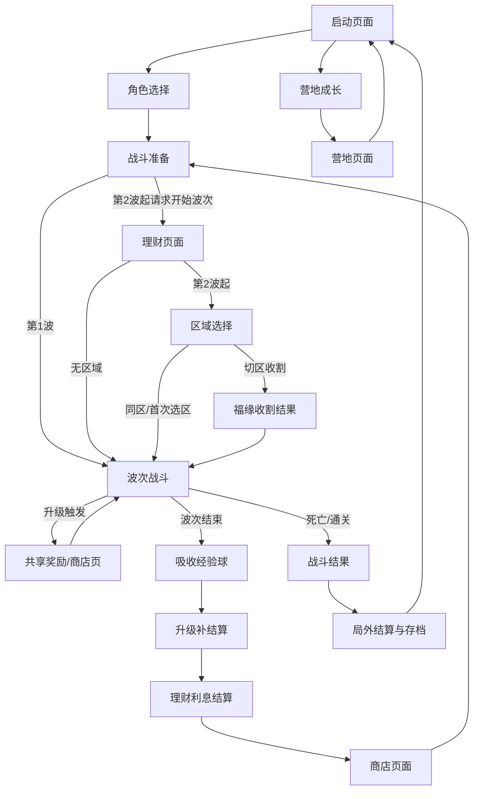

# 局内战斗循环与主流程编排详细设计

本模块定义从启动页进入战斗、营地、波次循环、弹窗顺序、结算与回到主入口的完整主流程。它只负责“流程编排”，不负责具体战斗数值、掉落内容、商店候选生成或存档字段定义。

## 1. 设计目标

1. 把“启动页面 -> 选择角色 -> 进入战斗 -> 波次循环 -> 结算 -> 返回主入口”的全流程统一编排起来。
2. 严格固定局内弹窗顺序，避免共享奖励/商店、商店、理财、区域选择、结算互相打架。
3. 保证战斗过程中不发生正式存档，只在死亡或通关时做最终结算与保存。
4. 为后续新增事件波、特殊弹窗、限时战斗、无尽模式保留扩展点。

## 2. 已确认主流程

### 2.1 战斗流

```text
启动页面
→ 选择角色
→ 确认角色后直接进入第一波战斗
→ 战斗过程中升级，立即弹出共享奖励/商店页
→ 波次倒计时结束
→ 吸收所有经验球并清理其他奖励拾取物
→ 如果升级，继续弹出共享奖励/商店页
→ 结算上一波理财利息
→ 弹出商店页面
→ 完成购买后回到战斗准备
→ 第 2 波起，下一波开始前弹出理财页面
→ 玩家决定是否存入或取出本金
→ 弹出区域选择页面（第 1 波结束后首次出现）
→ 如果切区触发福缘收割，则弹出收割结果页
→ 进入下一波战斗
→ 循环以上流程，直到死亡或通关
```

### 2.2 营地流

```text
启动页面
→ 选择购买天赋 / 营地成长
→ 进入营地页面
→ 购买营地建筑升级选项
→ 全游戏生效
```

这里的“购买天赋”在当前项目里等价于“营地建筑提供的全局升级项”。

### 2.3 总流程图



## 3. 模块职责

### 3.1 本模块负责

- 管理主入口与二级入口之间的切换。
- 管理战斗流程中的状态机。
- 管理局内弹窗的出现顺序。
- 管理波次开始、波次结束、升级、商店、理财、区域选择、结果页的调用顺序。
- 在战斗结束时触发最终结算，并把结果交给存档模块。

### 3.2 本模块不负责

- 不负责武器伤害公式与战斗数值计算。
- 不负责敌人 AI、刷怪规则与掉落内容生成。
- 不负责商店候选池权重算法。
- 不负责遗物、武器、营地建筑的具体数据定义。
- 不负责正式存档结构设计。

## 4. 建议实现形态

建议使用一个轻量流程协调器承载本模块，例如 `MainFlowCoordinator` 或等价脚本。

- 可以放在主入口场景根节点脚本里。
- 也可以升级为轻量全局协调层，但只负责切场景和分发事件。
- 不建议把战斗数值逻辑塞进协调器。

## 5. 战斗状态机

### 5.1 状态定义

| 状态 | 作用 | 关键动作 | 退出条件 |
|---|---|---|---|
| `start_page` | 启动页面 | 显示战斗入口、营地入口、设置入口 | 玩家选择入口 |
| `character_select` | 角色选择 | 载入可选角色、初始武器、角色图标 | 确认角色 |
| `battle_prepare` | 战斗准备 | 组装局外成长、初始属性、初始武器 | 准备完成 |
| `wave_combat` | 当前波次战斗 | 开始波次计时、刷怪、战斗演算 | 波次结束或角色死亡 |
| `shared_reward_shop_popup` | 共享奖励/商店页 | 暂停战斗并显示免费奖励或购买选项 | 玩家完成选择 |
| `wave_end_absorb` | 波次收尾吸收 | 吸收全部经验球，清理其他奖励拾取物并统一结算经验 | 吸收完成 |
| `interest_settlement` | 理财结算 | 展示利息收益并把收益加入本金 | 结算完成 |
| `shop_popup` | 商店页面 | 展示当前波次商店候选 | 玩家购买或跳过 |
| `finance_popup` | 理财页面 | 允许玩家在下一波开始前存入或取出本金 | 玩家确认 |
| `zone_select` | 区域选择 | 展示区域倾向、连驻压力、福缘收割预览 | 玩家确认区域 |
| `zone_harvest_result` | 福缘收割结果 | 展示切区后的一次性收割结果 | 玩家确认 |
| `battle_result` | 战斗结果 | 显示死亡/通关结果 | 结果确认 |
| `camp_entry` | 营地入口 | 切回营地或主入口 | 玩家返回 |

### 5.2 状态优先级

1. `battle_result` 优先级最高。
2. `shared_reward_shop_popup` 优先级高于普通战斗。
3. `wave_end_absorb`、`interest_settlement`、`shop_popup`、`finance_popup`、`zone_select`、`zone_harvest_result` 必须按固定顺序执行，其中 `finance_popup` 从第 2 波开始在下一波开始前打开。
4. 同一时刻只允许一个模态弹窗存在。

### 5.3 暂停规则

打开共享奖励/商店页、商店页、理财页时：

- 暂停波次计时。
- 暂停敌人 AI。
- 暂停玩家输入。
- 暂停局内战斗结算推进。

## 6. 单波流程

### 6.1 波次开始

1. 从波次配置读取本波时长。
2. 当前规则沿用 `min(15 + 5 * n, 50)`。
3. 生成本波敌人。
4. 开启波次计时。
5. 允许玩家正常战斗。

### 6.2 战斗中升级

当玩家经验达到升级阈值时：

1. 立刻暂停战斗。
2. 打开共享奖励/商店页。
3. 完成选择后返回当前波次。
4. 如果升级后又满足升级条件，继续弹出下一次共享奖励/商店页。

### 6.3 波次结束

当波次计时结束时：

1. 停止刷怪。
2. 吸收场上所有经验球，清理其余奖励拾取物。
3. 统一结算经验与金币。
4. 若因为吸收经验再次升级，则继续弹出共享奖励/商店页。
5. 结算上一波理财利息并加入本金。
6. 打开商店页面。
7. 商店结束后回到战斗准备。
8. 第 2 波起，玩家请求下一波时，先打开理财页面。
9. 玩家决定是否存入或取出本金，再进入区域选择或下一波战斗。

## 7. 理财与商店顺序

本项目的顺序固定为：

1. 波次结束。
2. 吸收经验球。
3. 可能触发共享奖励/商店页。
4. 结算理财利息并加入本金。
5. 打开商店页。
6. 回到战斗准备。
7. 第 2 波起，请求下一波时打开理财页。
8. 理财确认后进入区域选择或下一波。

理财规则沿用基础数值模块的定义：

- 第一波开始前不打开理财页；第 2 波起，每波开始前可打开理财页。
- 玩家可以选择存入、取出或跳过；自定义数量不可超过当前金币或可取本金。
- 本波结束时不自动返还本金，只把 `ceil(finance * interest_rate / 100)` 的利息加入本金。
- `interest_rate` 默认值为 `5`。

## 8. 战斗结束与存档

### 8.1 允许结束条件

- 角色死亡。
- 当前战斗通关。

### 8.2 结束流程

1. 进入战斗结果页。
2. 汇总本局奖励。
3. 生成局外货币回流。
4. 调用存档模块写入局外进度。
5. 返回启动页面或营地入口。

### 8.3 禁止事项

- 不允许在波次中间写正式存档。
- 不允许在升级页、商店页、理财页写正式存档。
- 不允许做“中途退出继续本局”。

## 9. 与其他模块的接口

### 9.1 来自玩家与角色模块

- `character_id`
- 初始属性
- 局外成长叠加后的属性
- 初始武器列表

### 9.2 来自局内武器模块

- 当前已装备武器列表
- 武器升级状态
- 武器负载状态

### 9.3 来自局内遗物与羁绊模块

- 当前遗物列表
- 当前羁绊等级
- 羁绊和遗物提供的战斗期属性

### 9.4 来自敌人与波次模块

- 当前波次编号
- 波次时长
- 刷怪结束事件
- 波次结束清理事件
- `shared_reward_shop_requested` 是升级奖励/商店触发的主信号；旧 `free_shop_requested` 仅做兼容，进入同一弹窗并按等级去重。

### 9.5 来自掉落与奖励模块

- 经验球吸收
- 金币结算
- 商店候选生成结果

### 9.6 来自存档模块

- 仅在战斗结束时调用正式保存。
- 只保存局外进度，不保存战斗过程。

## 10. 扩展点

后续如果要增加新内容，只需要在这个状态机里插入新阶段即可，例如：

- 特殊事件波。
- Boss 前剧情弹窗。
- 无尽模式的额外结算页。
- 区域连驻奖励收割页。

## 11. 验收标准

- 能从启动页正确进入战斗或营地。
- 战斗中升级会立刻弹出共享奖励/商店页。
- 波次结束后会先吸收经验球并清理其余奖励拾取物，再结算利息，再开商店；第 2 波起，下一波开始前再开理财。
- 战斗中不会正式存档。
- 死亡或通关后会完成最终结算并回到主入口。
