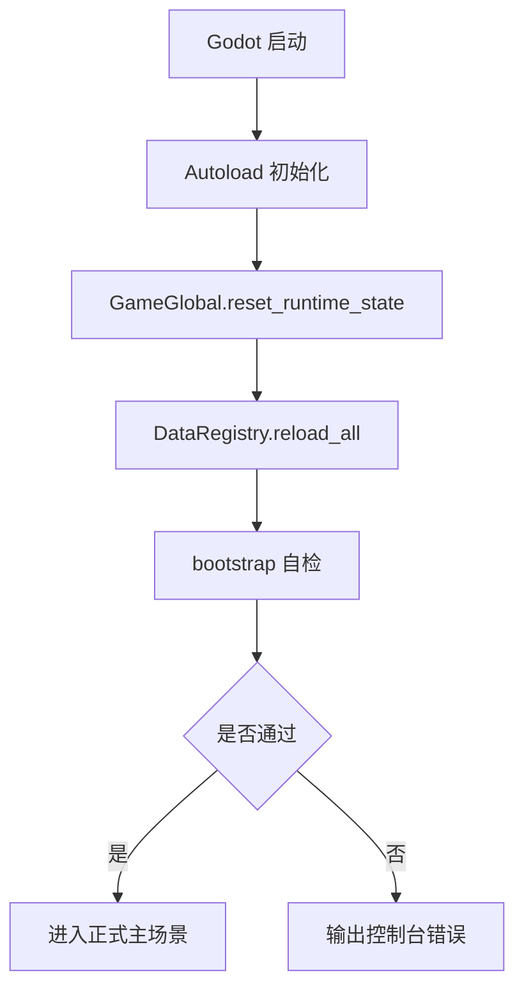

# 第 14 模块：工程基础设施模块详细设计

本模块是整个项目的运行底座，负责“怎么启动、怎么组织目录、怎么挂全局服务、怎么复用对象、怎么做统一自检”。它不承载具体玩法规则，只为后续所有玩法模块提供稳定的工程环境。

> 说明：旧版 `2-engineering_foundation_design.md` 保留为早期草稿，本稿是当前推荐的第 14 模块设计版本。

## 1. 模块目标

1. 固定项目目录、场景与脚本的组织方式。
2. 固定全局 Autoload 服务的边界与职责。
3. 提供稳定的启动入口与启动自检入口。
4. 提供统一的对象池和运行时状态服务。
5. 降低后续所有玩法模块的接线成本与返工成本。

## 2. 模块边界

### 2.1 本模块负责

- 项目目录结构与命名规范。
- `Autoload` 服务注册与跨模块共享状态。
- 启动场景、正式主场景、调试场景的骨架组织。
- 高频实体对象池的统一管理。
- 启动自检、调试日志、运行时标记与基础诊断输出。

### 2.2 本模块不负责

- 具体角色、武器、敌人、遗物、营地建筑规则。
- 具体 UI 业务逻辑。
- 掉落内容、波次内容、商店内容。
- 数值公式本体。

## 3. 目录与命名

### 3.1 推荐目录

```text
res://
├─ autoloads/
├─ data_config/
├─ docs/
├─ scenes/
│  ├─ core/
│  ├─ player/
│  ├─ enemies/
│  ├─ weapons/
│  ├─ rewards/
│  ├─ camp/
│  └─ ui/
├─ scripts/
│  ├─ core/
│  ├─ data/
│  ├─ modifiers/
│  ├─ player/
│  ├─ enemies/
│  ├─ weapons/
│  ├─ rewards/
│  ├─ camp/
│  └─ ui/
└─ assets/
   ├─ ui/
   ├─ sprites/
   └─ audio/
```

### 3.2 命名规范

- 工程名使用 `kebab-case`。
- Godot 场景与脚本优先使用 `snake_case`。
- 配置 `id` 使用稳定、可搜索的 `snake_case`。
- 常量使用 `UPPER_SNAKE_CASE`。
- 资源文件名前缀尽量固定，例如 `icon_`、`sfx_`、`bg_`、`sprite_`。

## 4. 全局服务设计

当前工程基础设施层推荐保留以下全局服务：

| 服务 | 职责 | 是否属于工程基础设施 |
| --- | --- | --- |
| `DataRegistry` | 配置加载、索引、校验、统计输出 | 是 |
| `GameGlobal` | 运行时标记、全局模式、调试开关、重置事件 | 是 |
| `ObjectPool` | 高频对象复用、预热、回收、清理 | 是 |
| `AudioManager` | 音量设置、播放接口、音效去重 | 是 |
| `CampProgression` | 局外营地运行态 | 业务服务，依赖工程基础设施 |
| `ZoneProgression` | 区域连驻运行态 | 业务服务，依赖工程基础设施 |

### 4.1 `DataRegistry`

- 只负责读取 `data_config/*.json`。
- 只负责缓存、索引、校验和启动摘要输出。
- 不承载任何玩法结算逻辑。
- 所有静态表都应能通过 `DataRegistry` 读取。

### 4.2 `GameGlobal`

- 用于全局运行时标记和模式切换。
- 提供 `runtime_state_reset`，供其他运行态服务订阅并清空自身状态。
- 只保存“运行时需要共享的信息”，不保存正式存档内容。
- 适合承载调试开关、当前游戏模式、临时标记。

### 4.3 `ObjectPool`

- 只负责高频实例的生命周期管理。
- 通过 `register_prefab / warmup / spawn / despawn / clear / clear_all` 提供统一接口。
- 不知道具体战斗规则，也不管理数值。
- 让敌人、投射物、经验球、血包、特效等重复创建成本更低。

## 5. 启动与入口

### 5.1 启动顺序



### 5.2 `bootstrap.tscn`

- 作为最小启动入口。
- 只做初始化和自检，不承载玩法逻辑。
- 适合快速检查 `Autoload`、配置加载、对象池和关键接口是否可用。
- 控制台输出应尽量稳定、可读、可搜索。

### 5.3 正式主场景

- 正式运行时建议由 `game_root.tscn` 承载核心容器。
- 主场景只负责把各模块接起来，不在根节点塞复杂规则。
- 如果后续需要独立调试场景，可再增加 `debug_root.tscn`。

## 6. 场景骨架

### 6.1 关键场景

- `scenes/core/bootstrap.tscn`：最小启动入口。
- `scenes/core/game_root.tscn`：正式运行根场景。
- `scenes/core/debug_root.tscn`：可选调试根场景。

### 6.2 子场景分层

- `player/`：玩家实体与玩家相关表现。
- `enemies/`：敌人实体与敌人表现。
- `weapons/`：武器挂点、武器实例、投射物逻辑。
- `rewards/`：掉落实体与奖励表现。
- `camp/`：营地界面与营地建筑表现。
- `ui/`：HUD 与弹窗层。

### 6.3 分层原则

1. 根节点只做职责分配。
2. 子节点尽量按“输入 / 逻辑 / 表现”拆分。
3. 高频重复节点优先进入对象池。
4. UI、战斗、营地三个大层尽量彼此独立。

## 7. 对象池设计

### 7.1 适用对象

- 敌人。
- 投射物。
- 经验球。
- 血包。
- 粒子特效。
- 其他高频短生命周期实体。

### 7.2 当前接口约定

- `register_prefab(pool_id, prefab, warmup_count)`：注册模板，可选预热。
- `spawn(pool_id, parent)`：取出并复用一个实例。
- `despawn(node)` / `release(node)`：回收实例。
- `warmup(pool_id, count, parent)`：提前创建空闲实例。
- `clear(pool_id)` / `clear_all()`：清空对象池。
- `get_pool_counts(pool_id)`：查看空闲 / 活动数量。

### 7.3 生命周期要求

- 进入池的节点必须能自我重置。
- 被取出时应支持 `on_pooled_spawned(pool_id)`。
- 被回收时应支持 `on_pooled_released(pool_id)`。
- 节点自身不应保存不可恢复的上一轮战斗状态。

### 7.4 预热原则

- 高频对象优先预热。
- 低频对象不强制预热。
- 预热数量以启动时间与战斗流畅度平衡为准。

## 8. 调试与自检

### 8.1 自检职责

- 验证 `DataRegistry` 是否成功加载所有配置。
- 验证 `ModifierStack`、角色、武器、波次、营地、主流程是否可接通。
- 验证对象池基础接口是否正常。
- 验证控制台输出是否稳定、可判断。

### 8.2 自检原则

1. 自检只做最小可行验证。
2. 自检结果必须能在控制台直接看出来。
3. 自检失败要尽量输出明确路径和原因。
4. 自检不要引入正式玩法逻辑。

## 9. 与其他模块的关系

- 基础数值与数据配置模块提供数据底座。
- 工程基础设施模块提供运行底座。
- 其他玩法模块只依赖服务，不反向耦合工程细节。
- 若某个共享能力会被多个模块使用，才考虑提升为 Autoload 或通用服务。

## 10. 扩展原则

1. 先加服务，不先改玩法。
2. 先补接口，不先补特例。
3. 先保稳定启动，再谈复杂调试面板。
4. 新增 Autoload 前先确认是否真的跨多个模块共享。

## 11. 验收标准

- 项目启动时无 Autoload 报错。
- `bootstrap.tscn` 能稳定执行自检。
- `DataRegistry`、`GameGlobal`、`ObjectPool` 的职责边界清晰。
- 后续玩法模块可以不改工程底座，直接按目录接入。
- 当新增敌人、武器、奖励或 UI 时，不需要重构启动结构。
