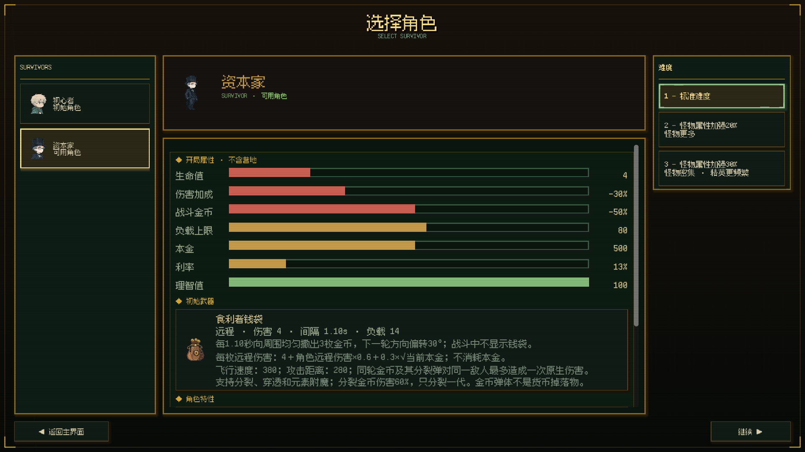

# 资本家角色设计审阅稿

日期：2026-09-27；美术更新于 2026-09-28。状态：已正式接入角色选择、开局遗物、银行结算与战斗动画。采用已确认的第二版数值及用户提供原图转换的 Picxel 美术；功能验证完成，长期强度仍需实战对比。

本版按用户确认：四件方案完整触发合计 500 本金的一次性奖励；通过角色属性进一步削弱进行平衡。当前美术采用外部原图、本地像素转换及局部修整，不调用图像生成 API。旧手工绘制造型及脚本已清理；下文第 6 节保留最初的设计方向，当前成品以 Picxel 包为准。

## 1. 角色定位

**资本家**

角色选择简介留空。

角色短句：**“损失可以转嫁，收益必须留下。”**

开局继承四份削减方案，用身体与战斗效率换取更高利率。玩家需要在取款补足生存能力和保留本金持续收息之间做选择。定位为经济构筑角色，难度高于初心者。

角色以“四份方案”提供经济优势，以“疏于实战”承担额外代价。初始武器为现有的食利者钱袋，本金直接支撑金币弹伤害；护甲、攻速和生命等成长继续通过遗物构筑获得。

## 2. 已核对的现有规则

本节记录接入时的现有规则；下文角色配置与首版机制均已实现。

| 现有史诗遗物 | 获得时效果 | 常驻效果 |
|---|---|---|
| 医疗削减方案 | 本金 +150 | 利率 +2 个百分点；回血 -0.5；血包恢复量 -1 |
| 福利削减方案 | 本金 +150 | 利率 +2 个百分点；最大生命 -3；护甲 -5 |
| 年假削减方案 | 本金 +100 | 利率 +2 个百分点；攻击速度 -12 |
| 薪酬调整方案 | 本金 +100 | 利率 +2 个百分点；金币获取 -10%；商店价格 +10% |

- 四件合计赠送本金 500、利率 +8 个百分点。当前基础利率为 5%，正常全量获得后为 13%，理智 100、无其他修正时，500 本金每次正常结息得到 65 金币。
- 初心者基础生命为 5、每级最大生命 +1。直接套用四方案后，一级最大生命仅剩 2。
- 负回血只抵扣后续正回血，不持续扣血。-0.5 不等同于每秒失去 0.5 生命。
- 当前普通血包基础恢复量为 1；血包恢复量 -1 后，该血包恢复 0。此项是实质生存代价。
- 护甲 -5 对应理论承伤约 105.26%；实际伤害按整数取整，小额攻击不一定增加扣血，不能高估这项惩罚。
- 攻速 -12 对应攻击频率为正常值的 88%，攻击间隔约增加 13.64%。
- 薪酬方案配置中商店折扣为 -10，按项目约定表示涨价 10%，与描述一致。
- “剩余价值”羁绊目前没有阈值效果，集齐四件不会再触发额外套装奖励。
- 利息进入随身金币，不自动增加本金；金币获取加成不再次作用于利息。

## 3. 角色特性：资本起家与疏于实战

**资本起家：开局获得四件方案，完整触发获得时效果，合计本金 +500；随身金币 0，初始利率 13%。**

500 本金全部来自四件方案（150 + 150 + 100 + 100），角色基础本金为 0，不能再额外发放一次 500。每个初始实例的获得时效果只触发一次；重建属性或重新打开界面不能重复赠款。局内以后正常获得同名遗物，仍按原配置触发奖励和叠加代价。

**疏于实战：角色自身伤害加成 -30%、金币获取加成 -40 个百分点，基础负载上限 80。** 叠加薪酬方案后，金币获取加成合计 -50%。这些修正仅属于新角色，不修改四件遗物的全局效果。

- 初始四件标记为“角色固有”，不能出售或移除；后续同名遗物不自动变为固有。这样不会出现保留开局资源、甩掉全部副作用的路径。当前可见出售流程主要处理武器和附魔，这里定义的是角色规则，不代表现在已有遗物出售功能。
- 初始固有实例的提示写明：“角色固有：开局获得时奖励已发放，不可移除。”不隐藏获得时收益。
- 存取遵循当前银行规则：本金可以正常手动取出，不设置专属锁定期、赎回税或隐藏手续费。
- 营地成长照常叠加；以下数值以无营地加成、一级、未获得其他遗物为基准。
- 四件仍沿用原图标、名称和常驻数值，不改全局遗物平衡，不创建四件同名弱化遗物。

## 4. 基础属性与玩家实际看到的开局值

| 项目 | 角色基础值（含角色固有代价） | 四方案作用后的开局值 |
|---|---:|---:|
| 最大生命 | 7 | **4** |
| 每级最大生命成长 | +1 | +1；升级不回血 |
| 每秒回血 | 0 | -0.5；实际自然恢复为 0 |
| 护甲 | 0 | -5 |
| 护盾／额外复活 | 0／0 | 0／0 |
| 伤害加成 | -30% | **-30%** |
| 攻击速度加成 | 0 | -12 |
| 移动速度 | 240 | 240 |
| 负载上限 | 80 | **80** |
| 拾取范围 | 180 | 180 |
| 理智 | 100 | 100 |
| 侵蚀度 | 0 | 0 |
| 幸运 | 0 | 0 |
| 基础利率 | 5% | **13%** |
| 金币获取加成 | -40% | **-50%** |
| 商店价格修正 | 0% | +10% |
| 血包恢复量加成 | 0 | -1 |
| 随身金币／本金 | 0／0 | **0／500** |

基础生命设为 7，是为了保留最终 4 点生命的容错，不是让玩家最终拥有 7 点生命。相比初心者仍少 1 点；攻速、恢复和购买力的代价全部保留。此次新增削弱集中在伤害、战斗收入与负载，移动速度保持一致，避免低血量与减速共同把角色变成开局操作惩罚。

伤害 -30% 使用现有伤害加成属性，与后续正伤害加成相加，不是不可修复的最终伤害乘区。金币获取 -50% 同样可以通过后续属性改善；仅作用于经过货币获取属性结算的战斗掉落收入，不减半利息、银行取款或哥布林直接赠款。

初始战斗装备为食利者钱袋，开局只有一个空附魔槽，不附带附魔，背包也不赠送附魔。钱袋沿用现有属性与本金伤害公式。拐杖仍属于角色外观，不增加独立伤害。

10% 克苏鲁是美术占比，不直接解释成初始侵蚀 +10，也不附送低理智或持续掉理智。理财优势保持完整，代价由四方案和角色自身属性共同承担。

## 5. 强度判断与主题关联

### 完整发放 500 本金，保留持续性的战斗短板

500 本金既能每波提供 65 金币，也可以在首次银行操作时变成 500 即时购买力。四份方案的代价中，负回血开局不会持续扣血、负护甲又可能被整数伤害取整削弱，不能只按“有四项负面”判断已经平衡。

新增的三个短板分别针对不同路径：

- **伤害加成 -30%**：购买力首先需要用于补回清怪能力。无其他加成、忽略整数取整和附魔独立机制时，与攻速 -12 合计使持续输出约为基准的 0.70 × 0.88 = 61.6%。实际战斗必须按武器和附魔分别验证，不能把这个比例当作全构筑统一结果。
- **战斗金币获取合计 -50%**：靠战斗赚取下一笔资金的效率降低，保留本金收息更有吸引力。全部取款后，可以立即补强，但会同时失去稳定利息来源。
- **负载上限 80**：减少把 500 金币全部转成更多武器的空间。初始食利者钱袋占用 14，剩余负载为 66。负载是总重量限制，不等于固定少一把武器。

不再降低开局生命或移动速度。当前商店普通遗物基础价格仅 15，500 金币仍是很大的早期优势；在假设货架无限、忽略刷新费用与本波收入附加、第一波开始无购买记录时，计入 +10% 涨价与购买次数递增，500 金币仍够买 18 件普通商品（473 金币）。实际货架与刷新会限制购买量，这个算例仅用于说明不能轻视提现路线。

因此本版是数值验证的起点，尚未经过角色实战对比，不能宣称已经保证不超标。用户指定的 500 本金与四件完整效果作为固定条件，后续优先调整角色伤害或负载，不再削减赠送本金。

### 银行内可以一眼理解的选择

理智 100、利率 13%、没有其他结息遗物时：

| 本金操作 | 剩余本金 | 下一次正常结息 |
|---|---:|---:|
| 保留开局本金 | 500 | 65 金币 |
| 取出 200 用于补强 | 300 | 39 金币 |
| 取出 400 用于补强 | 100 | 13 金币 |
| 全部取出用于补强 | 0 | 0 金币 |
| 后续积累至 1000 本金 | 1000 | 130 金币 |

这里仍采用现有名义利息向上取整规则。取款还会降低初始钱袋的本金伤害加成；若后来获得本金增加护甲、攻速或生命的遗物，则进一步失去对应属性。

### 高利率并不等于全程高购买力

在双方拥有相同本金 P、收集相同基础战斗金币 G、理智均为 100 时，忽略取整及其他效果，角色相对初心者的每波收入差约为：

**额外利息 0.08 × P − 战斗收入损失 0.50 × G。**

例如双方本金均为 500、基础战斗金币均为 100 时，资本家得到约 50 + 65 = 115 金币，初心者得到 100 + 25 = 125 金币；资本家还承担商店涨价与伤害、攻速惩罚。此例仅比较相同资产下的收入效率，不包含初始钱袋的战斗优势，也不抹去免费获得初始 500 本金的优势。

理智降到 50 时，13% 名义利率对应约 8.67% 的长期有效回报；500 本金第一次结息约到账 43 金币，余数累积。薪酬涨价与理智涨价乘算，购买成本约为原基准的 121%。因此堆利率同时接受哥布林的理智代价，会削弱实际购买力。

### 后续实战验证重点

接入后仍需以相同难度、营地等级和种子比较初心者与资本家。分别使用角色默认武器与统一武器进行比较，考察全取款、只花利息、持续存款三种策略：

- 前三波存活率与补强机会，尤其是首次银行开放前的低输出和普通血包失效造成的压力。
- 第 5、10 波的战斗强度、累计实际消费及本金，而非只看账面总资产。
- 营地理财、回血训练，以及伤害、负载、金币获取遗物是否过快消除了大部分代价。
- 叠加同名方案、哥布林利率交易、额外结息遗物后的上限表现。

若提现路线过强，优先比较角色伤害加成 -30% 调至 -40% 的效果；若全程存款路线过强，先检查本金遗物与额外结息的实际组合。若首次银行前明显过弱，优先比较伤害加成 -30% 放宽至 -20%，不同时降低输出与移速。每轮只改变一项角色参数，保留完整 500 本金，不通过全局修改四方案影响其他角色。

## 6. 美术方向

### 形象与轮廓

90% 是体面的旧式资本家，10% 是不易察觉的异常。延续当前干净、轻微可爱的像素小人风格。

- **体形**：中年、体格略厚实但腰腹收窄，外套线条平直，肩背挺直，下巴微抬，整体约 2.5 头身，高帽独立计入轮廓。表情克制、自信，嘴角略向上。
- **高帽**：黑色平顶礼帽，宽帽檐，旧金色窄帽带；帽顶完整可见，作为第一识别点。
- **脸部**：暖灰肤色、小八字胡、单片金边眼镜。两眼使用一致的三分之四视角，单片镜位于靠近镜头的眼睛上，镜片内保留清楚的眼白与瞳孔；鼻梁位于双眼之间，鼻尖缩短并下移，胡须顺着鼻子下方排列。
- **服装**：炭黑燕尾服、象牙白衬衣和手套、暗酒红马甲，少量旧金表链。外套在腰部合拢，红色马甲仅从胸前窄开口露出；收窄腹部轮廓，避免大面积红色造成鼓腹的视觉效果。
- **拐杖**：黑檀色细杖，旧金弧形杖头，手掌自然压在杖头，杖尖着地。与身体留出小段负形，让小尺寸下也能看出正在拄杖。
- **克苏鲁细节**：镜片深处极淡的幽绿反光；杖头有一个抽象卷须形雕纹，中心嵌小颗墨绿石。只占局部，不长出实体触手、不改变人体结构。
- **表演**：待机时轻抬下巴、手指压住杖头；行走时小步前进，拐杖有清楚的落点，衣摆轻动。第一版不设计大面积邪光、触手攻击或全身变形。

### 色板建议

| 用途 | 色值 | 视觉占比 |
|---|---|---|
| 轮廓／礼帽／外套 | #171A21、#2C303B | 约 62% |
| 肤色／衬衣／手套 | #D9CDB6、#F0E5CD | 约 20% |
| 马甲／暗部暖色 | #623A42 | 约 3% |
| 帽带／镜框／杖头 | #B99959、#E4C47C | 约 10% |
| 镜片／宝石的异常色 | #315C53、#7EB69B | 不超过 5% |

“10% 克苏鲁”按造型气质理解，不要求 10% 像素发绿；明亮幽绿控制在全身极小区域。最终限色整理时可增加同色系阴影，尽量保持 24–32 色。

### 与当前项目素材的适配

- 当前玩家展示源图为 256×256，战斗实际使用 54×54；新角色依此设计，不把大尺寸概念图直接缩小后当成成品。
- 单帧优先制作向右略侧身，左向沿用现有镜像规则；单片镜所在侧允许随镜像变化，不新增双向动画成本。
- 54×54 中优先保住帽檐、镜片亮点、白手套和拐杖轮廓。帽顶、杖尖与脚底均需留安全边距；身体和帽子一起适配原角色视觉高度。
- 战斗帧采用清楚的像素簇、一像素外轮廓、硬透明边缘；脚底锚点一致，碰撞体不随高帽或拐杖扩大。
- 以当前实际四帧行走为首版目标，不按旧文档六帧建议额外扩展。

## 7. 素材交付计划与当前状态

| 素材 | 规格与用途 | 当前状态 |
|---|---|---|
| 形象审阅板 | 两角色战斗、展示及头像规格对照 | 已完成并安装 |
| 角色展示单帧 | 256×256，向右、透明 PNG | 已接入角色详情 |
| 角色头像 | 128×128，保留帽子、单片镜和表情 | 已接入角色列表 |
| 战斗待机图 | 54×54，透明 PNG，由 64 像素稿裁去透明留白 | 已接入并实机检查 |
| 完整行走帧表 | 378×54，七帧横排，单帧 54×54 | 保留在审阅包供后续编辑 |
| 战斗行走帧表 | 216×54，四帧横排，单帧 54×54 | 已接入，6 FPS、左向镜像 |
| 四帧总览与实机行走 | Picxel 审阅板、游戏录像 | 已更新为当前造型 |

正式资源安装在 `assets/sprites/player/`、`assets/sprites/player/combat/` 与 `assets/ui/icons/characters/`。沿用四份方案原图标；初始武器为食利者钱袋，只有一个空附魔槽。

## 8. 美术制作记录与文件

2026-09-28 按用户要求替换为外部原图的 Picxel 转换结果。使用统一画布、每角色 16 色色板、网格投票、原图细线恢复和眼部局部修整。安装脚本先核对尺寸、透明度、色数和清单哈希，再覆盖两角色共 8 张同名正式纹理。

- [当前形象实机图](../../artifacts/reviews/characters/capitalist/selection.png)
- [透明角色展示图](../../assets/sprites/player/capitalist_idle_right.png)
- [透明头像](../../assets/ui/icons/characters/icon_capitalist.png)
- [54×54 战斗待机图](../../assets/sprites/player/combat/capitalist_idle_right.png)
- [实机行走动图](../../artifacts/reviews/characters/capitalist/walk.gif)
- [完整七帧行走表](../../artifacts/previews/player_picxel/delivery/capitalist/combat/capitalist_walk_right_all_frames.png)
- [战斗行走帧表](../../assets/sprites/player/combat/capitalist_walk_right_spritesheet.png)
- [可编辑像素稿、来源与修改流程](../../artifacts/previews/player_picxel/README.md)
- [安装与校验脚本](../../scripts/tools/install_player_picxel_assets.py)

展示图由独立的 128×128 转换稿最近邻放大为 256×256；战斗从 64×64 转换稿仅移除透明留白，导出为 54×54。头像由原图头肩区域独立转换为 128×128。透明素材只使用 0／255 的 Alpha。

原始输入共七张，全部保留；完整手部、鞋子及手杖均随整帧保留，不对身体部位分层裁切。色板及局部眼部修整记录保存在 Picxel 包内。

正式四帧行走选原图 1→3→5→7，待机选第 7 张，脚底统一到 y=52（不含该行）。资本家保持 6 FPS，左向整帧镜像；初心者于 2026-09-29 更新为完整八帧、7 FPS。未生成额外过渡帧。

已检查硬透明通道、四个独立姿态、边界留白、脚底基准、角色选择及实际战斗显示。[Picxel 包](../../artifacts/previews/player_picxel/README.md) 保留素材预览；[游戏内截图与行走实录](../../artifacts/reviews/characters/capitalist/README.md) 使用正式场景和角色控制器采集。

## 9. 实现与验证

- `characters.json` 新增 `character_capitalist`；`start_relics` 定义角色固有遗物，`combat_visuals` 定义待机、行走纹理、帧数与帧率。
- 银行初始化、获得遗物信号连接完成后，再经正常 `add_relic` 路径发放四件遗物。成功发放进度保存在本局角色中，属性重建、界面刷新和重复调用不会再发奖；重新开局先清理旧状态。
- 固有保护落在遗物实例上；移除同名普通副本不会移除固有原件。属性预览保留保护与发放状态，背包提示标明“角色固有”。
- 角色选择页通过独立玩家与银行预览计算最终开局属性，展示本金 500、生命 4、利率 13%；营地另行叠加。切换角色时清理旧详情，避免重复行。
- `capitalist_character_test.tscn`：97 项功能检查通过；启用实际截图采集后共 149 项通过。覆盖重复开局、500 本金来源、13% 利率、65/39 结息、战斗收入减半、直接赠款完整、普通同名副本、营地叠加、升级不回血、负回血不扣血、动画和实际菜单开战流程。
- 生命成长回归 61 项、本金遗物回归 76 项通过；Bootstrap 自检通过，配置校验 0 错误、0 警告；编辑器导入无脚本解析或编译错误。
- 验证时修复 GameRoot 已有节点路径泄漏备用节点的问题，并将 Bootstrap 中怪物数量的旧断言同步为现行双倍数量规则。未调整怪物强度。
- 环境记录：编辑器提示本机 Android build-tools 目录不可用；部分无界面回归（包括角色专项）在退出时报告 BGM Ogg 播放资源未释放，功能断言均通过。图形采集退出正常；本轮未做 Android 打包。
- 功能验证使用临时营地状态；录像关闭刷怪以便观察动作，并手动结束第一波展示 65 金币结算，不作为角色生存率或长期平衡证明。

## 10. 核对来源

- 角色基准：[characters.json](../../data_config/characters.json)
- 四方案配置：[relics.json](../../data_config/relics.json)
- 羁绊：[bonds.json](../../data_config/bonds.json)
- 属性默认值与护甲／攻速公式：[stat_definitions.gd](../../scripts/data/stat_definitions.gd)
- 理智经济修正：[humanity_economy.gd](../../scripts/data/humanity_economy.gd)
- 本金、获得时奖励及结息：[battle_finance_system.gd](../../scripts/rewards/battle_finance_system.gd)
- 血包恢复：[health_pack.gd](../../scripts/pickups/health_pack.gd)
- 当前战斗精灵规格：[combat_sprite_clarity.md](../asset/combat_sprite_clarity.md)
