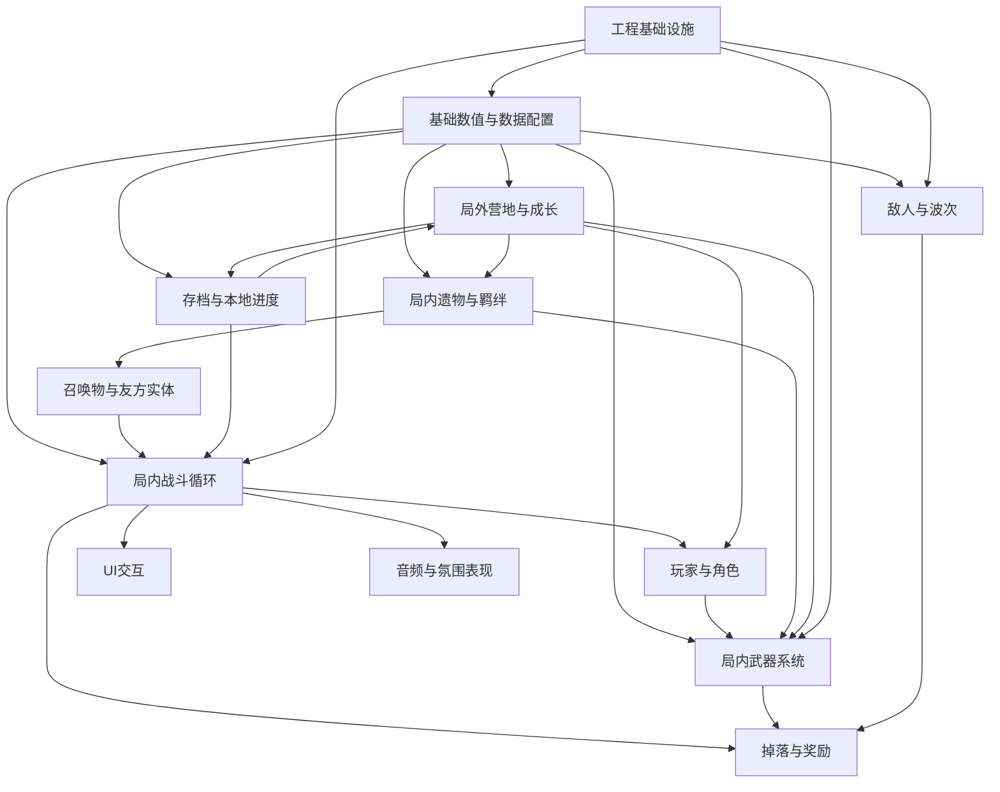

# Infinite-Build-Dome-Survival 模块化设计拆分概述

本文档用于把 `overview_design.md` 拆分为后续可独立展开的模块设计文档，方便 Godot 工程实现、数据配置、AI协作与迭代排期。当前仅定义模块边界、职责、关键依赖与建议落地顺序；详细字段、类结构、场景节点和接口在后续模块文档中展开。

## 1. 模块拆分原则

1. **数据先行**：所有武器、遗物、羁绊、敌人、角色、营地建筑、营地建筑都必须能由 `data_config/*.json` 驱动。
2. **局内局外分离**：局内只处理一局战斗内的临时状态；局外只处理永久成长、解锁、营地升级和存档。
3. **效果统一入口**：所有属性变化统一通过 `ModifierStack`，避免武器、遗物、营地建筑各自直接修改最终属性。
4. **MVP优先**：每个模块先定义最小可玩版本，再预留扩展字段，避免一开始实现完整商业版本。
5. **表现与逻辑解耦**：视觉、音频、UI反馈不直接承载核心规则，核心规则必须能在无表现资源时运行。

## 2. 核心模块总览

| 模块 | 主要职责 | MVP范围 | 后续扩展 |
| ---- | ---- | ---- | ---- |
| 基础数值与数据配置 | schema、DataRegistry、ModifierStack、通用属性 | 角色/武器/敌人基础属性与modifier计算 | 数据校验工具、调试面板、平衡表导出 |
| 局内战斗循环 | 单局状态、时间轴、经验、单局成长、胜负结算 | 18分钟闯关闭环 | 无尽模式、难度曲线、多事件时间轴 |
| 玩家与角色 | 移动、受击、角色被动、开局配置 | 1名默认角色 | 6名角色、解锁条件、角色特化构筑 |
| 局内武器系统 | 负载、装备、替换、升级、自动攻击 | 3把基础武器 + 负载替换 | 武器词条、畸变升级、稀有武器池 |
| 局内遗物与羁绊 | 遗物拾取、羁绊计数、2/3/5层效果、7层限制 | 2套羁绊 + 5层以内 | 6套羁绊、7层棱彩、羁绊主激活切换 |
| 敌人与波次 | 怪物属性、生成器、AI追踪、碰撞弹开、经验球清算、波次清场 | 普通怪 + 基础波次推进 | 多敌人类型、精英词缀、阶段Boss |
| 区域驻守与福缘收割 | 休整选区、连驻层数、福缘储备、收割结算、区域奖励倾向 | 3个固定区域 + 基础连驻惩罚 + 货币/定向遗物收割 | 多区域事件、稀有道具、区域词缀、动态风险预览 |
| 召唤物与友方实体 | 召唤物生成、生命周期、目标选择、伤害归属 | 简单跟随攻击召唤物 | 异位召唤羁绊、镜像、旧日虚影 |
| 掉落与奖励 | 经验球、局内金币、遗物/武器/商店选项池、最终局外货币结算 | 经验球 + 共享奖励/商店候选 | 稀有度、权重、裂隙奖励、最终结算奖励 |
| 局外营地与成长 | 营地建筑、升级选项、开放状态派生、存档 | 固定营地界面 + 8个建筑 | 更多建筑、图鉴、展示与扩展路线 |
| UI交互 | HUD、共享奖励/商店页、负载替换、羁绊面板、营地界面 | 战斗HUD + 共享奖励/商店页 | 完整菜单、营地升级树、结算、图鉴 |
| 音频与氛围表现 | BGM/SFX管理、克苏鲁氛围反馈、粒子/屏幕后处理 | 基础攻击/拾取/UI音效 | 分层BGM、低语、棱彩羁绊特效 |
| 存档与本地进度 | 存档读写、版本迁移、局外进度 | JSON本地存档 | 存档校验、备份、版本兼容 |
| 工程基础设施 | 目录结构、Autoload、对象池、调试工具 | DataRegistry/ObjectPool/GameGlobal | 性能统计、配置热重载、自动化测试 |

## 3. 模块依赖关系

## 4. 推荐详细设计文档拆分

### 4.1 基础数值与数据配置模块

建议文档：`1-base_data_and_modifiers_design.md`

核心内容：
1. 通用属性定义：生命、伤害、攻速、移速、暴击、拾取范围、负载上限等。
2. `DataRegistry`：配置加载、schema校验、缓存、错误提示。
3. `ModifierStack`：属性来源、叠加规则、优先级、临时效果生命周期。
4. JSON schema草案：武器、遗物、羁绊、敌人、角色、营地建筑的最小字段。
5. 数值调试规范：如何查看最终属性、来源拆解和异常叠加。

优先级：最高。其他模块都依赖此模块。

### 4.2 局内战斗循环模块

建议文档：`12-run_combat_loop_design.md`

核心内容：
1. 单局状态机：准备、战斗、暂停、升级选择、Boss、胜利、失败、结算。
2. 时间轴：0~18分钟波次、精英、Boss、裂隙事件触发。
3. 经验与升级：经验曲线、升级选项生成、暂停/恢复战斗。
4. 胜负条件：闯关模式与无尽模式差异。
5. 结算输出：死亡或通关后输出局外货币 `camp_currency`，不保存战斗过程。

优先级：最高。用于验证游戏是否“能玩”。

### 4.3 玩家与角色模块

建议文档：`3-player_and_character_design.md`

核心内容：
1. 玩家移动、碰撞、受击、死亡、拾取范围。
2. 角色基础属性与开局武器。
3. 角色被动如何转化为modifier。
4. 角色解锁条件与局外存档字段。
5. 角色选择界面需要的数据。

优先级：高。MVP先做1名默认角色。

### 4.4 局内武器系统模块

建议文档：`4-weapon_loadout_design.md`

核心内容：
1. 负载系统：总负载、武器负载、装备、替换、溢出弹窗。
2. 武器分类：轻型、中型、重型的定位与基础数值范围。
3. 自动攻击：冷却、目标选择、投射物/范围伤害/近战判定。
4. 武器升级：等级、强化路线、满级畸变词条。
5. 武器选项池：出现权重、已装备武器强化、新武器刷新。

优先级：最高。是核心差异化卖点之一。

### 4.5 局内遗物与羁绊模块

建议文档：`relic_bond_design.md`

核心内容：
1. 遗物数据结构：羁绊标签、稀有度、效果、出现条件。
2. 羁绊计数：2/3/5层普通效果，多羁绊并存。
3. 7层羁绊：当前阶段不做额外限制机制，局内凑够层数即生效。
4. 羁绊效果如何提交到 `ModifierStack`。
5. 羁绊UI：当前层数、下一档预览、激活中效果展示。

优先级：高。MVP先做 3 套羁绊与基础遗物堆叠。

### 4.6 敌人与波次模块

建议文档：`6-enemy_wave_design.md`

核心内容：
1. 敌人基础属性、移动AI、碰撞、受击、死亡。
2. 怪物分类：普通怪、精英怪、Boss。
3. 波次生成器：单波计时、玩家周围刷怪、经验球吸取、波次结束清场、强度曲线。
4. 性能策略：对象池、屏幕外处理、千怪同屏预算。
5. 敌人掉落与经验奖励。

优先级：高。MVP先做普通怪与基础波次推进。

### 4.7 区域驻守与福缘收割模块

建议文档：`zone_streak_fortune_design.md`

核心内容：
1. 休整阶段区域选择：每波结束后进入选区界面，决定下一波驻守区域。
2. 连驻状态：记录当前区域、连驻层数、福缘储备值、区域倾向强度。
3. 风险叠加：连续驻守同一区域时，逐层提高敌人强度并施加玩家 debuff。
4. 奖励积累：连驻层数达到2后，每守住一波增加福缘储备，不能中途支取。
5. 福缘收割：选择不同区域时一次性结算储备奖励，清空连驻层数与 debuff。
6. 系统联动：区域倾向影响遗物/羁绊权重，福缘储备交由掉落与奖励模块生成具体结果。

优先级：高。它直接强化“波次之间的策略选择”，建议在基础战斗闭环后、完整羁绊深化前实现。
### 4.8 召唤物与友方实体模块

建议文档：`summon_ally_design.md`

核心内容：
1. 召唤物生命周期：生成、跟随、索敌、攻击、消失。
2. 伤害归属：召唤物伤害如何计入玩家、羁绊和结算统计。
3. 数量上限：避免召唤流造成性能和数值失控。
4. 与羁绊关系：异位召唤、旧日回响镜像、旧日虚影。
5. MVP策略：先实现一个简单召唤物基类，后续复用。

优先级：中。可在遗物/羁绊稳定后实现。

### 4.9 掉落与奖励模块

建议文档：`drop_reward_design.md`

核心内容：
1. 局内掉落：经验球、金币、临时奖励、裂隙奖励。
2. 共享奖励/商店：武器、武器升级、遗物的选项池权重。
3. 局外奖励：死亡或通关后回流 `camp_currency`；波次过程不落盘。
4. 稀有度系统：普通、稀有、史诗、棱彩等是否需要首版开放。
5. 结算统计：击杀数、存活时间、最高伤害来源、构筑记录。

优先级：高。连接局内战斗和局外成长。

### 4.10 局外营地与成长模块

建议文档：`7-camp_meta_progression_design.md`

核心内容：
1. 营地定位：固定2D界面，不做自由建造、生产链和资源采集。
2. 建筑设计：记忆方碑、武备工坊、遗物陈列架、观星台、治愈篝火。
3. 营地建筑升级：消耗 `camp_currency`、属性提升、开放后续升级项。
4. 营地升级项：等级上限、花费、效果映射到局内参数。
5. 开放内容：武器池、遗物池和槽位优先由建筑等级与升级项等级派生。

优先级：中高。MVP可先做营地入口和3个建筑。

### 4.11 UI交互模块

建议文档：`8-ui_flow_design.md`

核心内容：
1. 战斗HUD：血量、时间、负载、经验、羁绊面板。
2. 弹窗：共享奖励/商店页、负载替换、结算、暂停。
3. 局外界面：营地、营地升级树、角色选择、模式选择、图鉴。
4. 输入与暂停：鼠标/键盘/手柄适配优先级。
5. UI数据绑定：UI只读取状态，不直接修改核心规则。

优先级：高。共享奖励/商店页和负载替换直接影响核心体验。

### 4.12 音频与氛围表现模块

建议文档：`10-audio_atmosphere_design.md`

核心内容：
1. `AudioMixer`：BGM/SFX音量、播放接口、音效去重。
2. 战斗音效：攻击、命中、拾取、升级、Boss、裂隙。
3. 氛围表现：低语、虚空侵蚀、棱彩触发、屏幕震动。
4. 粒子与后处理：虚空边缘、触手残影、畸变特效。
5. 资源导入规范：循环BGM、像素特效、音量基准。

优先级：中。MVP需要基础反馈，复杂氛围可后置。

### 4.13 存档与本地进度模块

建议文档：`11-save_progress_design.md`

核心内容：
1. 存档字段：`camp_currency`、建筑等级、升级项等级和音量设置。
2. 存档时机：死亡或通关后的最终结算、营地升级购买、音量设置变化。
3. 存档版本：版本号、缺省字段补全、迁移策略。
4. 数据安全：临时文件写入、失败回滚、损坏存档处理。
5. 与 `DataRegistry` 的关系：存档只保存局外进度，不复制配置表完整内容。

优先级：中高。局外成长开始前必须实现。

### 4.14 工程基础设施模块

建议文档：`2-engineering_foundation_design.md`

核心内容：
1. Godot目录结构与Autoload列表。
2. 对象池：敌人、投射物、经验球、粒子预制体。
3. 调试工具：刷怪、加经验、加遗物、查看modifier。
4. 性能预算：实体数量、投射物数量、粒子数量、UI刷新频率。
5. AI协作规范：文件命名、模块边界、禁止跨模块硬改数据。

优先级：最高。能显著降低后续返工成本。

## 5. 推荐落地顺序

### 阶段A：工程与数据地基

1. 工程基础设施模块
2. 基础数值与数据配置模块
3. 存档与本地进度模块的最小版本

目标：能加载JSON、计算modifier、保存局外进度。

### 阶段B：最小局内闭环

1. 玩家与角色模块
2. 敌人与波次模块
3. 局内武器系统模块
4. 掉落与奖励模块
5. 区域驻守与福缘收割模块的最小版本
6. UI交互模块的战斗HUD、共享奖励/商店页和休整选区弹窗

目标：能完成一局最小战斗：移动、刷怪、自动攻击、升级、区域选择、福缘收割、死亡/胜利结算。

### 阶段C：核心差异化机制

1. 局内遗物与羁绊模块
2. 武器负载替换与武器升级深化
3. 区域奖励倾向与羁绊追构筑反馈
4. 羁绊面板与构筑反馈
5. 召唤物与友方实体模块的最小基类

目标：形成“负载取舍 + 区域贪层数 + 羁绊追构筑”的核心体验。

### 阶段D：局外留存

1. 局外营地与成长模块
2. 营地建筑与升级选项
3. 建筑等级与升级项派生开放内容
4. 结算奖励与营地反馈

目标：让玩家每局结束后有明确的长期成长目标。

### 阶段E：表现、平衡与扩展

1. 音频与氛围表现模块
2. Boss和裂隙事件扩展
3. 7层棱彩羁绊开放
4. 无尽模式与本地纪录

目标：提升完成度和可重复游玩价值。

## 6. MVP建议模块范围

首个可玩版本建议只实现以下内容：

1. 基础数值与数据配置：最小 `DataRegistry` + `ModifierStack`。
2. 玩家与角色：1名默认角色。
3. 局内武器：3把武器，完整负载装备与替换。
4. 敌人与波次：1种普通怪 + 基础波次推进。
5. 遗物与羁绊：2套羁绊，只开放2/3/5层。
6. 区域驻守与福缘收割：3个固定区域、基础连驻惩罚、换区收割。
7. 掉落与奖励：经验球、共享奖励/商店候选、局内商店、最终 `camp_currency` 结算。
8. 局外营地：固定营地界面 + 记忆方碑 + 武备工坊 + 治愈篝火。
9. UI：战斗HUD、共享奖励/商店页、负载替换弹窗、休整选区弹窗、简易结算面板。

暂不实现：完整6角色、全部6羁绊、7层棱彩实装、无尽模式、复杂裂隙事件、完整图鉴、完整音频分层。
## 7. 后续文档产出顺序建议

1. `1-base_data_and_modifiers_design.md`
2. `2-engineering_foundation_design.md`
3. `3-player_and_character_design.md`
4. `4-weapon_loadout_design.md`
5. `relic_bond_design.md`
6. `enemy_wave_design.md`
7. `12-run_combat_loop_design.md`
8. `zone_streak_fortune_design.md`
9. `7-camp_meta_progression_design.md`
10. `8-ui_flow_design.md`
11. `11-save_progress_design.md`
12. `7-camp_meta_progression_implementation_checklist.md`
13. `7-camp_meta_progression_asset_checklist.md`
14. `8-ui_flow_implementation_checklist.md`
11. `summon_ally_design.md`
12. `drop_reward_design.md`
13. `10-audio_atmosphere_design.md`
